# DoE vignettes for cell-based experiments

A guided tour of design-of-experiments (DoE) ideas, written for a molecular biologist
who runs cell-based assays at the bench. Each vignette pairs a concept with a worked
example using this library and a note on the figure you would look at.

The running scenario is one most wet-lab scientists recognise: **optimising a transient
transfection** in adherent cells, and a couple of neighbouring assays (viability, a
reporter readout). The factors are things you actually pipette and set on an incubator.

> Conventions used throughout
>
> - A **factor** is an input you control (DNA amount, serum %, time). A **response** (or
>   _readout_) is what you measure (% GFP+, luminescence, viable-cell count).
> - Continuous factors are modelled in **coded units**: the low setting is `-1`, the high
>   setting is `+1`, and the midpoint is `0`. This is just a rescaling — it makes effects
>   directly comparable and the maths well-behaved. You always _enter_ and _read out_ real
>   ("natural") units; the library does the translation.
> - An **effect** is the change in the readout when you move a factor from `-1` to `+1`
>   (i.e. across its whole tested range). In coded units an effect is exactly twice the
>   regression coefficient — useful to remember when reading a model.
>
> Every console output and figure below is real: it is produced by running the snippets
> via `scripts/build_vignette_assets.py`, which writes the figures to `docs/img/`. The
> readouts in Vignettes 6–13 use a synthetic-but-realistic dome surface so the examples are
> fully reproducible; swap in your own plate data and the same calls apply.

**The road ahead.** The nineteen vignettes are grouped into seven short parts that follow the
arc of a real study — screen, model, trust, decide, run — so you can read straight through as a
course or jump to the part that answers your question:

- **Part I — Foundations.** Why vary factors together, and how to read a fitted effect.
- **Part II — Screening.** Many suspect factors, few wells: cheaply find the ones that matter.
- **Part III — Response surfaces.** Map a curved readout, and lay out runs that can capture the curvature.
- **Part IV — Trusting the model.** Before you act on a fitted surface, confirm it is not lying to you.
- **Part V — Locating & balancing the optimum.** Pin the best settings down exactly, and reconcile readouts that conflict.
- **Part VI — Running the experiment.** Randomise the order and export a run sheet so the plate can't fool you.
- **Part VII — Evaluating & generating designs.** Judge a design before you run it — and build a custom one when the named recipes don't fit.

The "Where to go next" table at the very end maps common tasks straight to the right tool and
the part that covers it.

---

## Part I — Foundations: reading a designed experiment

*Why design experiments at all, and how to read what one tells you.*

### Vignette 1 — Why not change one thing at a time?

**Concept: OFAT vs. factorial.** The instinct at the bench is _one factor at a time_
(OFAT): fix everything, titrate DNA, pick the best, then fix DNA and titrate lipid. It
feels careful. It has two failure modes:

1. **It is blind to interactions.** If the best DNA amount _depends_ on how much lipid you
   use (it usually does — they form the complex together), OFAT can walk you to a local
   sweet spot and call it the global one.
2. **It is wasteful.** Every run spent holding a factor constant tells you nothing about
   that factor.

A **factorial design** varies factors _together_, in a structured grid, so every run
informs every effect. With two factors at two levels each, the full factorial is just the
four corners of a square:

```python
from doe import ContinuousFactor, full_factorial

dna   = ContinuousFactor("dna_ng",   low=100, high=500, units="ng/well")
lipid = ContinuousFactor("lipid_uL", low=0.5, high=2.5, units="uL/well")

design = full_factorial([dna, lipid], levels=2)
print(design.runs)
#    dna_ng  lipid_uL
# 0   100.0       0.5
# 1   100.0       2.5
# 2   500.0       0.5
# 3   500.0       2.5
```

Four wells (plus replicates) buy you both main effects **and** their interaction. The
same four numbers under OFAT would give you main effects only, and only along the edges
you happened to walk.

**The figure: watching OFAT stall.** The picture below makes the first failure mode
concrete. Both panels show the _same_ underlying %GFP+ landscape — a surface with a strong
DNA×lipid interaction, so its best region runs as a **diagonal ridge** climbing toward high
DNA _and_ high lipid together (the brightest corner, top-right). On the left, OFAT starts at
low DNA / low lipid, titrates DNA with lipid held low (the horizontal arrow along the bottom
edge), picks the best DNA, then fixes it and titrates lipid (the vertical arrow). Because it
only ever moves along one axis at a time — and the first leg was run at the _wrong_ lipid
level — it climbs the side of the ridge and **stops at ~51% GFP+**, circled in red, nowhere
near the peak. On the right, the four factorial corners _straddle_ the ridge; the top-right
corner alone already reads **~70%**, and fitting all four reveals the "push both up together"
direction OFAT never sees.

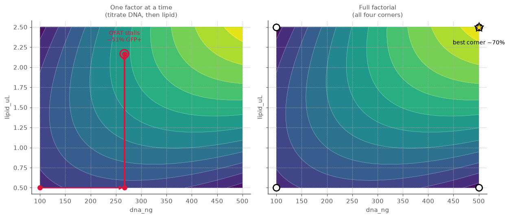

The gap between ~51% and ~70% is not noise or bad luck — it is a structural consequence of
the interaction. Whenever the best level of one factor depends on another, an axis-by-axis
walk can only find a point that is optimal _along each axis in turn_, which is generally not
the global optimum. The factorial grid escapes the trap by refusing to hold anything constant.

**Takeaway.** Factorial designs are not just "more conditions" — they are a _geometry_
that makes each well do double duty. Everything else in this guide builds on that grid.

---

### Vignette 2 — Coded units and main effects

**Concept: coding, and reading a main effect.** Suppose you ran the 2×2 above in
triplicate and measured % GFP-positive cells. Fit a linear model and look at the effects.

```python
import numpy as np
from doe import ContinuousFactor, full_factorial, fit_ols

dna   = ContinuousFactor("dna_ng",   100, 500)
lipid = ContinuousFactor("lipid_uL", 0.5, 2.5)
design = full_factorial([dna, lipid], levels=2)   # the 4 corners

# triplicate readout (% GFP+), three wells per corner; replace with real plate data
gfp = np.array([22, 20, 24,    # low DNA,  low lipid
                31, 29, 33,    # low DNA,  high lipid
                40, 38, 42,    # high DNA, low lipid
                58, 60, 62])   # high DNA, high lipid

# replicate each condition 3x (consecutively) to line up with the triplicates above.
# `each=True` keeps a condition's replicates together; the default repeats the whole
# design instead.
rep = design.replicate(3, each=True)

# attach the readout as a column: `with_response` checks it has one value per run (12 == 12),
# so it can't silently misalign, and the values ride along with their runs from here on.
# Then fit by column name instead of passing a bare array.
rep = rep.with_response("gfp", gfp)

result = fit_ols(rep, "gfp", model="linear")
print(result.summary().round(2))
#                  coefficient  effect  std_error      t    p
# term
# Intercept              38.25   38.25       0.58  66.25  0.0
# dna_ng                 11.75   23.50       0.58  20.35  0.0
# lipid_uL                7.25   14.50       0.58  12.56  0.0
# dna_ng:lipid_uL         2.75    5.50       0.58   4.76  0.0
```

How to read it:

- The **intercept** is the predicted readout at the _center_ of the design (coded `0,0`) —
  here, the grand mean, ~38% GFP+.
- The **`dna_ng` effect** (~+23.5) is how much %GFP+ changes as DNA goes from 100 → 500 ng,
  _averaged over_ the lipid settings: "more DNA, more signal across the board."
- The **`lipid_uL` effect** (~+14.5) is the analogous swing for lipid.

Because everything is in coded units, the effects are on a common footing: a factor with a
bigger |effect| moves the readout more across its tested range, regardless of whether its
natural units are nanograms or microlitres.

**The figure: a main-effects plot.** `main_effects_plot(result)` draws each main-effect
coefficient as a point against a zero line. Steeper / further-from-zero points are the
factors that matter. It is the first plot to look at after a screen — it answers "which
knobs actually do anything?" at a glance.

```python
from doe.plotting import main_effects_plot
ax = main_effects_plot(result)
```


Both points sit well above zero, with `dna_ng` (~+11.75) the steeper of the two — DNA is
the bigger knob here, lipid the secondary one. (Recall the plot shows _coefficients_; the
effects you read in the table are twice these.)

---

### Vignette 3 — The thing OFAT misses: interactions

**Concept: interaction effects.** Look again at the GFP numbers. Going from low to high
lipid adds ~+9 points _at low DNA_ (22→31) but ~+20 points _at high DNA_ (40→60). The
benefit of lipid **depends on** the DNA level. That dependence is the **interaction**, and
a factorial design estimates it directly:

```python
result = fit_ols(rep, gfp, model="linear")   # 'linear' here includes 2-factor interactions
row = result.summary().loc["dna_ng:lipid_uL", ["coefficient", "effect"]]
print(row["effect"])   # +5.5 -- the dna x lipid interaction effect (coded units)
```

A non-trivial `dna_ng:lipid_uL` term is the biology you would have missed with OFAT:
DNA and lipid co-titrate because they form the transfection complex together; the optimum
is a _ridge_, not a point on one axis.

How to read an interaction effect: it is _half the difference of the two slopes_. If lipid
helps a lot at high DNA and only a little at low DNA, the interaction is large and positive.
When an interaction is present, **you cannot talk about a factor's "best" level without
naming the other factor's level** — which is exactly why one-at-a-time tuning misleads.

**The figure: an interaction plot.** `interaction_plot(result, "dna_ng", "lipid_uL")` draws
the fitted readout against one factor (DNA) as a separate line for each level of the other
(lipid). It is the most direct picture of an interaction there is: **parallel lines mean no
interaction** (the effect of DNA is the same whatever the lipid setting), while **lines that
fan apart or cross** _are_ the interaction, made visible.

```python
from doe.plotting import interaction_plot
ax = interaction_plot(result, "dna_ng", "lipid_uL")   # default: lines at lipid's low & high
```

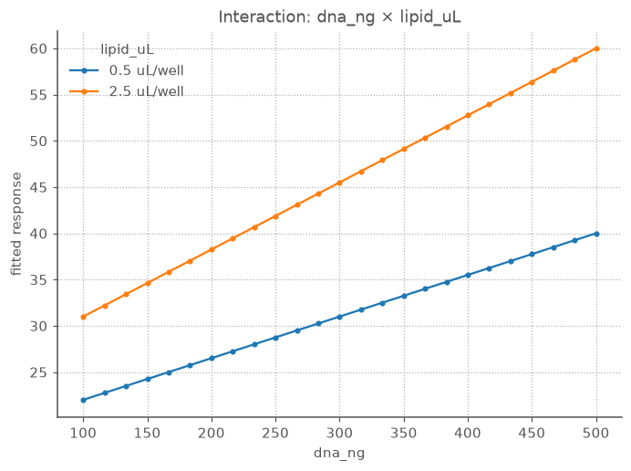

The two lines splay outward rather than running parallel. At low lipid (0.5 µL) the DNA line
climbs gently, 22 → 40% GFP+; at high lipid (2.5 µL) it climbs more steeply, 31 → 60. That
widening gap — ~9 points apart at low DNA, ~20 at high DNA — is exactly the `dna_ng:lipid_uL`
interaction the table reported as +5.5, drawn out. Parallel lines would have said the two
reagents act independently; the visible fan is the co-titration OFAT walks right past. (By
default the trace lines sit at the factor's low and high; pass `trace_levels=[...]` for more.)

**The figure: a Pareto plot of effects.** `pareto_plot(result)` sorts every term
(main effects and interactions) by |effect| as a horizontal bar chart. It tells you, in
rank order, where the signal is — and whether an interaction bar is tall enough to take
seriously next to the main effects.

```python
from doe.plotting import pareto_plot
ax = pareto_plot(result)
```


The ranking is unambiguous: `dna_ng` (|effect| ≈ 23.5) > `lipid_uL` (≈ 14.5) >
`dna_ng:lipid_uL` (≈ 5.5). The interaction bar is the short one at the bottom — real and
worth keeping, but a fraction of the mains. That ordering is exactly the story the numbers
told; the bar chart just makes "is the interaction big enough to care about?" a one-glance
call.

---

## Part II — Screening: finding the factors that matter

*Many candidate factors, few wells: cheaply isolate the vital few.*

### Vignette 4 — Screening: which of _many_ factors matter?

**Concept: fractional factorials.** Early in assay development you often have a long list of
suspects: seeding density, serum %, DMSO %, compound concentration, incubation time,
passage number. A full factorial in 6 factors at 2 levels is `2^6 = 64` corner conditions —
before replicates. That is a lot of plate real estate to spend on factors that may not
matter.

A **fractional factorial** runs a cleverly chosen _fraction_ of those corners. You give up
the ability to resolve some high-order interactions (you _alias_ them — deliberately
confound a term you believe is negligible with one you care about), in exchange for far
fewer runs. It is the workhorse **screening** design: cast a wide net cheaply, find the 2–3
factors that dominate, then study those properly.

```python
from doe import ContinuousFactor, fractional_factorial

A = ContinuousFactor("seeding_cells", 5_000,  20_000, units="cells/well")
B = ContinuousFactor("serum_pct",     2,      10,     units="%")
C = ContinuousFactor("dmso_pct",      0.1,    1.0,    units="%")
D = ContinuousFactor("compound_uM",   0.1,    10,     units="uM")

# half-fraction of a 2^4: 8 runs instead of 16. D is aliased with the A*B*C interaction.
design = fractional_factorial([A, B, C, D], generators=["D=ABC"])
print(design.n_runs)   # 8
print(design.coded())
#    seeding_cells  serum_pct  dmso_pct  compound_uM
# 0           -1.0       -1.0      -1.0         -1.0
# 1           -1.0       -1.0       1.0          1.0
# 2           -1.0        1.0      -1.0          1.0
# 3           -1.0        1.0       1.0         -1.0
# 4            1.0       -1.0      -1.0          1.0
# 5            1.0       -1.0       1.0         -1.0
# 6            1.0        1.0      -1.0         -1.0
# 7            1.0        1.0       1.0          1.0
```

Eight wells, run once each (no replication — that is the point of a screen). Suppose the
measured readout came back like this; fit a linear model and rank the effects:

```python
import numpy as np
from doe import fit_ols

# one viability-proxy readout per run (no replicates -> no residual degrees of
# freedom for tests; we only need the effect *sizes* to spot the hits)
y = np.array([31.0, 55.2, 68.8, 44.5, 54.7, 30.4, 45.0, 69.8])
result = fit_ols(design, y, model="linear")

# rank terms by |effect|
summary = result.summary()
ranked = summary.reindex(summary["effect"].abs().sort_values(ascending=False).index)
for name, row in ranked.iterrows():
    if name != "Intercept":
        print(f"{name:>28s}: {row['effect']:+.2f}")
#                 compound_uM: +24.40
#                   serum_pct: +14.20
#        dmso_pct:compound_uM: +0.32
#     seeding_cells:serum_pct: +0.32
#               seeding_cells: +0.10
#                    dmso_pct: +0.10
#   seeding_cells:compound_uM: +0.08
#          serum_pct:dmso_pct: +0.08
#       serum_pct:compound_uM: +0.08
#      seeding_cells:dmso_pct: +0.08
```

Two effects (`compound_uM`, `serum_pct`) tower over a floor of near-zero terms — those
near-zero terms are the inert factors and aliased interactions, all just noise. That is the
signal a half-normal plot is built to make obvious.

The string `"D=ABC"` is the **generator**: it _defines_ the fourth factor's column as the
product of the first three. That is the price of the fraction — `D`'s main effect shares a
column with the three-way `A·B·C` interaction. Three-way interactions are rarely real in a
cell assay, so this is usually a safe trade.

**The figure: a half-normal plot of effects.** `half_normal_plot(result)` plots the
_absolute_ effects against half-normal quantiles. The idea: if a factor is pure noise, its
effect is a draw from a normal centred on zero, and the inert effects fall on a straight
line through the origin. The **real** factors are the points that jump _off_ that line to
the upper right. It is the classic "which effects are signal vs. noise?" read for a screen
with little or no replication.

```python
from doe.plotting import half_normal_plot
ax = half_normal_plot(result)   # labelled points; the ones off the line are your hits
```


`compound_uM` and `serum_pct` sit high and to the right, clearly detached from the dense
cluster of inert terms hugging the bottom-left (those overlapping labels at |effect| ≈ 0
are seeding density, DMSO, and every aliased interaction — pure noise). Two real factors
out of four, found in eight wells. Those are the two to take forward into a response-surface
study.

---

### Vignette 5 — Plackett–Burman: the leanest screen

**Concept: saturated main-effect screening.** A half-fraction got 4 factors into 8 runs.
But what if the suspect list is _long_ — eleven candidate factors, and you can only afford a
dozen wells? A regular fractional factorial jumps in powers of two (8, 16, 32 …), so eleven
factors would force you to 16 runs. A **Plackett–Burman** design fits `k` factors into the
smallest available Hadamard run count with room for `k` factor columns: eleven factors in
**twelve** runs. It is the most run-frugal two-level screen there is.

```python
from doe import ContinuousFactor, plackett_burman

factors = [
    ContinuousFactor("seeding_cells",  5_000, 20_000, units="cells/well"),
    ContinuousFactor("serum_pct",      2,     10,     units="%"),
    ContinuousFactor("dmso_pct",       0.1,   1.0,    units="%"),
    ContinuousFactor("compound_uM",    0.1,   10,     units="uM"),
    ContinuousFactor("incubation_h",   24,    72,     units="h"),
    ContinuousFactor("passage_num",    5,     25,     units="passage"),
    ContinuousFactor("dna_ng",         100,   500,    units="ng/well"),
    ContinuousFactor("lipid_uL",       0.5,   2.5,    units="uL/well"),
    ContinuousFactor("antibiotic_pct", 0.0,   1.0,    units="%"),
    ContinuousFactor("coating_ugml",   1,     50,     units="ug/mL"),
    ContinuousFactor("media_age_d",    1,     14,     units="d"),
]

pb = plackett_burman(factors)
print(pb.n_runs)   # 12  -- eleven factors, twelve wells

# the design is balanced and the main effects are perfectly orthogonal
coded = pb.coded().to_numpy()
print((coded.sum(axis=0) == 0).all())                 # True: each column is 6 high / 6 low
print(np.allclose(coded.T @ coded, 12 * np.eye(11)))  # True: X^T X = 12 I
```

The left panel below is the design matrix itself: twelve runs, eleven `±1` columns, every
column split exactly six high / six low, and every pair of columns orthogonal. That
orthogonality is what lets you estimate all eleven main effects independently from twelve
wells.

The catch is the right panel — the **alias-structure heatmap** (`correlation_heatmap`, the
general design-diagnostic tool introduced in Vignette 16). It shows the correlation between every
pair of model terms: the eleven main effects are mutually orthogonal (the off-diagonal `0`s among
them), but each two-factor interaction is _partially_ aliased (correlation `0` or exactly `±1/3`)
with **many** main effects, not cleanly confounded with one. This "complex aliasing" is the price
of the lean run count, and it is the visual signature that distinguishes PB from a regular fraction
(whose interactions would be either fully aliased, `±1`, or not at all, `0`). With 66 terms the
numbers are too dense to read — the _pattern_ is the message.

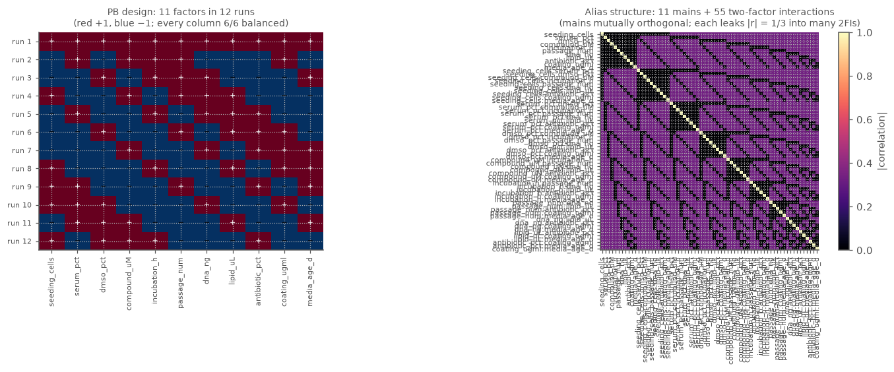

Because of that aliasing, you fit **main effects only** — asking for interactions on twelve
runs over-parameterises the model and smears the real effects across their aliases. With a
main-effects fit the signal is clean:

```python
import numpy as np
from doe import fit_ols

# one readout per run; here compound, DNA and serum are the true drivers
y = np.array([69.7, 58.8, 62.3, 79.5, 52.5, 48.8, 80.5, 49.6, 40.5, 52.4, 57.4, 68.4])

# main effects only: a saturated screen cannot resolve the aliased interactions
result = fit_ols(pb, y, order=1, interactions=False)
summary = result.summary()
ranked = summary.reindex(summary["effect"].abs().sort_values(ascending=False).index)
for name, row in ranked.iterrows():
    if name != "Intercept":
        print(f"{name:>16s}: {row['effect']:+.2f}")
#      compound_uM: +18.03
#           dna_ng: +12.23
#        serum_pct: -9.63
#         lipid_uL: -0.90
#         dmso_pct: -0.40
#     incubation_h: +0.37
#      passage_num: -0.20
#     coating_ugml: -0.13
#   antibiotic_pct: +0.07
#      media_age_d: -0.07
#    seeding_cells: -0.03
```

Three factors (`compound_uM`, `dna_ng`, `serum_pct`) stand an order of magnitude above a
floor of near-zero terms — the eight inert factors. Eleven suspects narrowed to three in
twelve wells. Take those three into a response-surface study (Vignettes 6–7); the partial
aliasing means a PB hit is a candidate worth confirming, not yet a quantified effect.

> **PB vs. fractional factorial.** Reach for Plackett–Burman when you have many factors, you
> only care _which_ matter (not their interactions), and run budget is tight — its available
> run counts are multiples of four, not just powers of two. Reach for a fractional factorial
> when you want cleaner, interpretable aliasing (and the ability to dealias interactions with
> follow-up runs). Both are screens; PB trades interaction information for the leanest possible
> design.

---

## Part III — Response surfaces: designing for a curved landscape

*Once a factor matters, map its curved response — and lay out runs that can capture the curvature.*

### Vignette 6 — Replication, center points, and "is it just curved?"

**Concept: center points and pure error.** Two-level designs only ever sample the _corners_,
so they can fit a _plane_ (mains + interactions) but can't see **curvature** — the very
common situation where a readout rises, peaks, then falls (too little compound does nothing;
too much is toxic). Adding **center points** — replicate runs at the dead middle of every
factor — fixes two things at once:

1. **Replication gives you pure error.** Several wells at _identical_ settings differ only by
   experimental noise. That spread is your **pure-error** yardstick — the irreducible
   well-to-well variability, estimated without trusting any model.
2. **Center points detect curvature.** If the average readout at the center sits well off the
   average of the corners, the surface is bowed, and a flat (first-order) model is
   inadequate.

The **lack-of-fit test** formalises (2): it compares the variation the model _fails_ to
explain against pure error. A _non-significant_ lack-of-fit (large p) means "the model is
adequate — its misses are no bigger than plate noise." A _significant_ one says "there's
structure here your model isn't capturing" — usually a cue to add quadratic terms.

```python
import numpy as np
from doe import ContinuousFactor, central_composite, fit_ols

dna   = ContinuousFactor("dna_ng",   100, 500)
lipid = ContinuousFactor("lipid_uL", 0.5, 2.5)

# a CCD includes replicated center points by default (here: 4 of them)
design = central_composite([dna, lipid], center=4)
print(design.n_runs, design.n_center)   # 12 4

# measured % GFP+, one value per run (this is the same readout used in Vignette 7).
# Runs 8-11 are the four center-point replicates: 60.0, 59.1, 60.9, 60.8 -- nearly
# identical, and their spread *is* the pure-error estimate.
y = np.array([30.3, 37.0, 46.8, 66.9, 38.0, 60.7,
              47.1, 60.7, 60.0, 59.1, 60.9, 60.8])
result = fit_ols(design, y, model="quadratic")
lof = result.lack_of_fit()   # the fit remembers the design + response it came from
print(f"F = {lof.f_stat:.3f}, p = {lof.p_value:.4f}")   # F = 1.583, p = 0.3576
```

A p-value of **0.36** is comfortably large: the model's misses are no bigger than the
well-to-well noise the center replicates revealed, so the quadratic surface is adequate. A
small p here (say < 0.05) would have been the cue that real structure is escaping the model.

**The figure: what curvature looks like, and why corners miss it.** The plot below is a
one-dimensional slice through the fitted surface along the DNA axis (lipid held at its
center). It shows exactly what a two-level design can and cannot see. The two blue points are
the **corner runs** at coded `−1` and `+1`; a design that samples _only_ corners has no
choice but to connect them with a **straight line** (the grey dashed chord) — a first-order
model is, by construction, flat between its endpoints. The orange diamond is the **center
point** at coded `0`. If the true response were linear, it would land _on_ the chord. Instead
it sits **~9.8 points above** it (the red arrow): the readout at the middle setting is higher
than the average of the two ends, which can only happen if the surface bows.

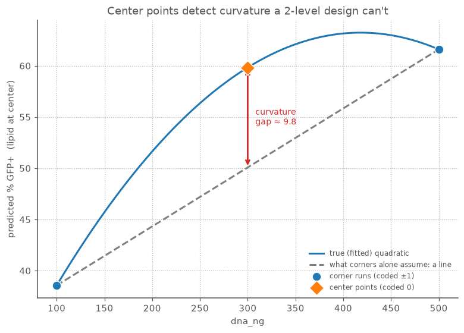

That vertical gap _is_ the curvature, and it is precisely the signal the lack-of-fit test
turns into a p-value: it measures how far the center-point average departs from what the
corners predict, scaled against pure error. A corners-only design would have drawn the dashed
line straight through and reported the middle as ~50% GFP+; the center replicates catch the
readout actually sitting near 60% and say "there's a dome here — fit the curve." (The size of
the gap, ~9.8, is essentially the magnitude of the `dna_ng²` coefficient from the Vignette 7
fit; negative curvature of that size is what bends the chord down into the interior.)

**Rule of thumb.** Always salt a design with a few center-point replicates. They cost a
handful of wells and buy you both an honest noise estimate and an early warning that you
need a curved model.

---

### Vignette 7 — Response surfaces: finding the optimum, not just the direction

**Concept: response-surface methodology (RSM).** Screening tells you _which_ factors matter
and _which direction_ helps. To actually **locate an optimum** — the DNA:lipid ratio that
maximises transfection without tipping into toxicity — you need a model with curvature: a
**quadratic** (second-order) surface. That requires factors at **three or more levels**,
which is what response-surface designs provide.

The **central composite design (CCD)** is the standard choice. It is a 2-level factorial
_core_ (the corners), plus **axial / star points** that stick out along each axis (to
estimate the squared terms), plus center replicates (pure error, as above):

```python
from doe import ContinuousFactor, central_composite, fit_ols

dna   = ContinuousFactor("dna_ng",   100, 500)
lipid = ContinuousFactor("lipid_uL", 0.5, 2.5)

# "faced" keeps every run inside your stated low/high bounds (no extrapolation),
# which is convenient when the bounds are real pipetting/biology limits.
design = central_composite([dna, lipid], alpha="faced", center=4)

y = np.array([30.3, 37.0, 46.8, 66.9, 38.0, 60.7,
              47.1, 60.7, 60.0, 59.1, 60.9, 60.8])   # measured % GFP+ per run
result = fit_ols(design, y, model="quadratic")
print(result.summary().round(2))
#                  coefficient  effect  std_error       t    p
# term
# Intercept              59.83   59.83       0.43  137.88  0.0
# dna_ng                 11.52   23.03       0.39   29.67  0.0
# lipid_uL                6.73   13.47       0.39   17.35  0.0
# dna_ng:lipid_uL         3.35    6.70       0.48    7.05  0.0
# dna_ng^2               -9.75  -19.50       0.58  -16.75  0.0
# lipid_uL^2             -5.20  -10.40       0.58   -8.93  0.0
print(f"R^2 = {result.r_squared:.4f}")   # R^2 = 0.9966
```

The fitted quadratic has main effects, the interaction, **and** `dna_ng^2`, `lipid_uL^2`
terms. Both squared terms are **negative** — they bend the surface into a dome, and a dome
has a peak. (If they had come back near zero, the surface would be a tilted plane and the
"optimum" would just be a corner — a sign you should widen the factor ranges.)

**The figure: a contour plot.** This is the payoff visualisation. `contour_plot(result, "dna_ng", "lipid_uL")`
draws the fitted surface as a topographic map in **natural units**: filled bands of
predicted readout with labelled contour lines. You _read the optimum straight off it_ —
the centre of the innermost ring — and, just as usefully, you see the _shape_: a tight bullseye
means the optimum is finicky; a long diagonal ridge means many DNA:lipid combinations work
equally well (and you should pick the cheapest/most robust point on the ridge).

```python
from doe.plotting import contour_plot
ax = contour_plot(result, "dna_ng", "lipid_uL")
```

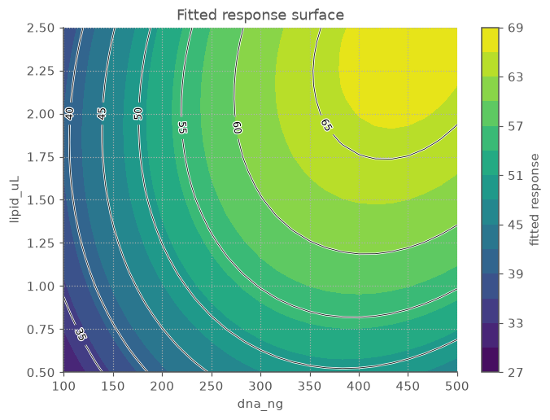

Read it like a topographic map: the bright yellow island in the upper right (high DNA, high
lipid) is the predicted optimum, and the contour rings nest around it. The bands are not
concentric circles but tilted ovals — that tilt is the `dna_ng:lipid_uL` interaction made
visible (the two reagents co-titrate). The "65" ring is broad rather than a tight bullseye,
which is good news: a range of high-DNA/high-lipid combinations land near the peak, so you
have room to pick a robust, pipettable setting rather than chasing one finicky point.

When you want the numbers rather than the picture, ask the fit for its optimum directly —
`result.optimum()` runs a constrained search over the design box and reports the best point
in natural units (no manual grid scan):

```python
opt = result.optimum()            # maximize over the coded box by default
print(opt)
# Optimum(max: dna_ng=448.6, lipid_uL=2.387 -> 67.1)

print(f"predicted optimum: {opt.natural['dna_ng']:.0f} ng DNA, "
      f"{opt.natural['lipid_uL']:.2f} uL lipid -> {opt.response:.1f}% GFP+")
# predicted optimum: 449 ng DNA, 2.39 uL lipid -> 67.1% GFP+
```

So the model's best guess is ~449 ng DNA with ~2.39 µL lipid for ~67% GFP+. The
`opt.at_bound` flag is `False` here, which is the reassuring case: the optimum sits in the
interior of the design region, not pinned to an edge. Combined with `alpha="faced"` (every
run stayed inside your stated bounds), this optimum is an _interpolation_ you can trust — not
an extrapolation past where you actually pipetted. If `at_bound` were `True`, the surface
would still be climbing at the edge of where you explored, and the "optimum" would really be
a signpost to run a follow-up design shifted in that direction.

For an unconstrained view — the surface's true stationary point plus a canonical analysis
classifying it as a maximum, minimum, or saddle — use `result.stationary_point()`. And when
you need the raw grid (e.g. to feed your own plotting), `contour_plot`'s underlying
`surface_grid(result, "dna_ng", "lipid_uL")` is still there.

**More than two factors?** Hold the others fixed and slice. With a third factor (say serum
%), `surface_grid(result, "dna_ng", "lipid_uL", fixed={"serum_pct": 10})` shows the DNA×lipid
surface _at_ 10% serum; change the fixed value to see how the landscape shifts.

---

### Vignette 8 — A leaner surface: Box-Behnken designs

**Concept: an alternative response-surface design.** The CCD in Vignette 7 finds an optimum
beautifully, but it has two awkward features. Its rotatable/circumscribed form places **axial
points outside the box** (you'd have to pipette beyond your stated limits), and even the faced
version runs the **extreme corners** — every factor at its high simultaneously. With three or
more factors, "all factors maxed at once" can be the well that's flat-out toxic, or simply
impossible (you can't have maximum DMSO _and_ maximum compound).

A **Box-Behnken design (BBD)** sidesteps both. It is a 3-level design that samples the
**midpoints of the edges** of the factor box plus center replicates — so it never sets all
factors to an extreme at the same time, and every run stays on a sphere comfortably inside the
corners. For three factors it needs just 15 runs (12 edge + 3 center) and still fits a full
quadratic.

```python
from doe import ContinuousFactor, box_behnken, fit_ols

dna   = ContinuousFactor("dna_ng",   100, 500)
lipid = ContinuousFactor("lipid_uL", 0.5, 2.5)
serum = ContinuousFactor("serum_pct", 2,  10, units="%")

design = box_behnken([dna, lipid, serum], center=3)
print(design.n_runs, design.n_center)   # 15 3
print(design.coded())
#     dna_ng  lipid_uL  serum_pct
# 0     -1.0      -1.0        0.0   <- a dna x lipid edge, serum held at center
# 1     -1.0       1.0        0.0
# 2      1.0      -1.0        0.0
# 3      1.0       1.0        0.0
# 4     -1.0       0.0       -1.0   <- a dna x serum edge, lipid at center
# ...
# 12     0.0       0.0        0.0   <- center replicates
# 13     0.0       0.0        0.0
# 14     0.0       0.0        0.0
```

Notice that **no row is all ±1** — every run holds at least one factor at its center. That is
the defining property: you never visit a corner. Fit the same quadratic model you would for a
CCD:

```python
y = np.array([30.0, 39.4, 47.2, 65.5, 30.7, 38.5, 53.6, 60.9,
              38.7, 44.2, 53.6, 59.9, 60.7, 59.9, 59.6])   # measured % GFP+ per run
result = fit_ols(design, y, model="quadratic")
print(result.summary().round(2))
#                     coefficient  effect  std_error       t     p
# term
# Intercept                 60.07   60.07       0.49  123.31  0.00
# dna_ng                    11.07   22.15       0.30   37.13  0.00
# lipid_uL                   7.29   14.57       0.30   24.43  0.00
# serum_pct                  3.36    6.72       0.30   11.27  0.00
# dna_ng:lipid_uL            2.22    4.45       0.42    5.27  0.00
# dna_ng:serum_pct          -0.12   -0.25       0.42   -0.30  0.78
# lipid_uL:serum_pct         0.20    0.40       0.42    0.47  0.66
# dna_ng^2                  -8.86  -17.72       0.44  -20.17  0.00
# lipid_uL^2                -5.68  -11.37       0.44  -12.94  0.00
# serum_pct^2               -5.28  -10.57       0.44  -12.03  0.00
print(f"R^2 = {result.r_squared:.4f}")   # R^2 = 0.9982
```

All three factors help, all three quadratics are negative (a dome in 3-D), and serum's two
interactions are negligible — serum acts independently here. With a third factor the surface
lives in 3-D, so to _see_ it you fix one factor and slice the other two (as introduced at the
end of Vignette 7):

```python
from doe.plotting import contour_plot
ax = contour_plot(result, "dna_ng", "lipid_uL", fixed={"serum_pct": 10})
```

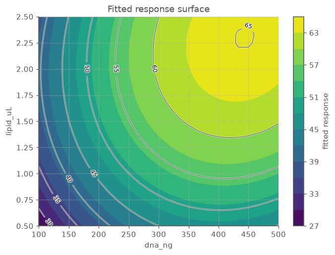

This is the DNA×lipid landscape _at 10% serum_; change `fixed` to slice at a different serum
level and watch the whole surface lift or drop with serum's main effect.

**CCD or Box-Behnken?** Both fit the same quadratic. Reach for a **CCD** when you want the
corners (a factorial core you may already have run as a screen) or rotatability; reach for
**Box-Behnken** when corner combinations are infeasible or risky and you want to stay inside
the box with fewer runs. For three factors BBD is the economical, safe-by-construction choice.

---

## Part IV — Trusting the model

*Before you act on a fitted surface, check that it is not lying to you.*

### Vignette 9 — Trusting the model: diagnostics before decisions

**Concept: residual diagnostics.** A model can have a beautiful R² and still be lying to
you — a missed curvature, a single toxic outlier well, or variance that grows with signal.
Before you commit reagents to the "optimum," check the **residuals** (observed − fitted).
Two quick plots catch most problems.

**Residuals vs. fitted.** `residuals_vs_fitted(result)` scatters each residual against its
fitted value, with a line at zero. You want a **structureless cloud** centred on zero. What
the patterns mean at the bench:

- A **funnel** (residuals fan out as fitted values grow) → variance scales with signal;
  consider a log transform of the readout (common for luminescence/fluorescence).
- A **U or arch** → systematic curvature the model missed; add quadratic terms (Vignette 7).
- **One point far out** → a suspect well (edge effect, a bubble, a pipetting slip). Check the
  plate map before trusting or discarding it.

```python
from doe.plotting import residuals_vs_fitted
ax = residuals_vs_fitted(result)   # uses the Vignette 7 quadratic fit
```

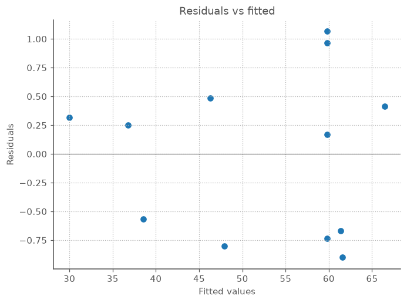

This is what "healthy" looks like: residuals scatter in a roughly even band around zero
across the whole fitted range (~30 to ~67% GFP+), with no funnel and no arch. The points
bunched near a fitted value of ~60 are the four center replicates — their tight vertical
spread is the pure-error noise the lack-of-fit test in Vignette 6 leaned on. Nothing here
argues for a transform or extra terms.

**Normal Q-Q.** `normal_qq(result)` plots the ordered residuals against normal quantiles.
If the noise is roughly Gaussian (the assumption behind the p-values and confidence
intervals), the points hug the diagonal. Heavy tails or a strong S-curve mean the
significance calls are on shaky ground.

```python
from doe.plotting import normal_qq
ax = normal_qq(result)
```


The points track the red reference line closely, with only mild wander at the tails (normal
for a 12-run design) — no strong S-curve, no points flung far off the line. The Gaussian-noise
assumption behind the p-values and confidence intervals holds, so the significance calls from
the fit can be trusted.

**Predicted vs. actual.** `predicted_vs_actual(result)` scatters each predicted value against
the value you actually measured, with a 45° reference line. It is the most direct "does the
model agree with the wells?" check: points hugging the line mean the model reproduces the data,
while systematic departures — a single run flung off the line, or a banana-shaped bend through
the cloud — flag a suspect well or a missing term. The title carries R², the same goodness-of-fit
number made visual.

```python
from doe.plotting import predicted_vs_actual
ax = predicted_vs_actual(res_ccd)   # the Vignette 7 quadratic fit
```

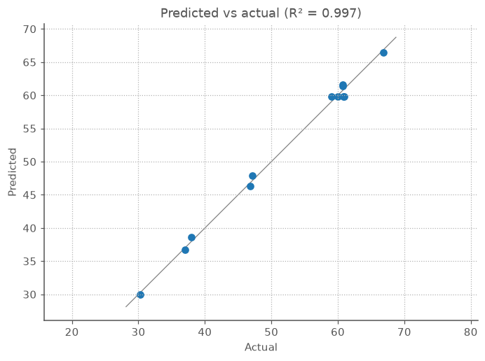

Every point sits tight against the diagonal across the whole 30 → 67% GFP+ range — the visual
face of the R² ≈ 0.997 from Vignette 7. No run strays from the line (no suspect well), and there
is no curvature in the cloud that would betray a term the model is missing. The little knot near
60% is the four center replicates again, predicted almost identically. Read alongside the two
residual plots, this is a model you can act on.

**Takeaway.** Diagnostics are cheap insurance. A few plots stand between a tidy summary table
and a wasted confirmation experiment.

---

### Vignette 10 — Big vs. real: ANOVA and significance

**Concept: significance testing.** Every vignette so far has ranked terms by the _size_ of
their effect. But size alone can mislead: a large effect estimated from noisy wells may be a
fluke, while a modest one measured cleanly may be rock-solid. To separate "big" from
"trustworthy" you need the **standard error** of each estimate — and that needs spare runs.
A design with more runs than model terms has **residual degrees of freedom**, and those let
you compute p-values and confidence intervals. (This is exactly what the unreplicated,
aliased screen in Vignette 4 lacked: it could rank effect _sizes_, never test them. The CCD
from Vignettes 6–7 has 12 runs for a 6-term model, leaving 6 residual degrees of freedom —
enough to do statistics.)

The **ANOVA table** partitions the total variation in the readout into a piece for each term
plus a leftover **residual**. Each term's mean square is compared (an **F-ratio**) against
the residual: a large F — and the small p-value that goes with it — means that term explains
far more variation than noise alone would.

```python
# res_ccd is the quadratic fit from Vignette 7
tbl = res_ccd.anova()   # same table as anova_table(res_ccd, design, y), no re-passing
print(tbl)
#                    SS  df     MS      F          p
# dna_ng          795.8   1  795.8  880.4  9.716e-08
# lipid_uL        272.0   1  272.0  301.0  2.351e-06
# dna_ng:lipid_uL  44.9   1   44.9   49.7  4.083e-04
# dna_ng^2        395.6   1  395.6  437.7  7.769e-07
# lipid_uL^2       72.1   1   72.1   79.8  1.099e-04
# Residual          5.4   6    0.9    NaN        NaN
# Total          1586.0  11    NaN    NaN        NaN
```

Every term clears significance comfortably (all p < 0.001): the two main effects, the
interaction, _and_ both quadratic terms are real, not artefacts. Note how small the
`Residual` SS (5.4) is next to the term SS — the model captures almost all the variation, the
numerical echo of the R² ≈ 0.997 from Vignette 7.

The companion view is a **confidence interval** on each coefficient. `res_ccd.conf_int(0.95)`
returns a DataFrame with `lower`/`upper` columns, one row per term; an interval that excludes
zero is the same verdict as "p < 0.05," but it also tells you _how precisely_ the effect is
pinned down.

```python
ci = res_ccd.conf_int(0.95)   # DataFrame: "lower"/"upper" columns, one row per term
print(ci.round(2))
#                  lower  upper
# term
# Intercept        58.77  60.90
# dna_ng           10.57  12.47
# lipid_uL          5.78   7.68
# dna_ng:lipid_uL   2.19   4.51
# dna_ng^2        -11.17  -8.33
# lipid_uL^2       -6.62  -3.78
```

**The figure: a coefficient plot with intervals.** The table above is easier to read as a
picture. `res_ccd` here is the Vignette 7 quadratic fit; plotting each coefficient as a point
with its 95% CI as a whisker turns "is this term real?" into a one-glance geometric check —
**does the whisker cross the red zero line?**

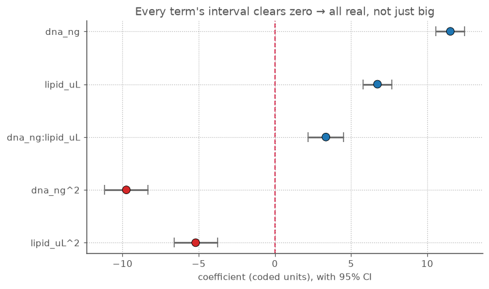

Every interval sits entirely to one side of zero, so every term earns its place. Two things
the picture adds over the number table: the **whisker length** shows how precisely each
effect is pinned down (all tight here — the CCD estimates every term cleanly), and the
**sign** is immediate — the two quadratic terms (red, left of zero) are the downward
curvature that makes the surface a dome, while the three positive terms (blue) push the
readout up. None of these intervals straddle zero, so every term earns its place. The
negative quadratic intervals (both entirely below zero) are the statistical confirmation of
the dome from Vignette 7: the downward curvature that gives the surface a peak is not an
accident of the fit.

**Takeaway.** Rank by effect size to _find_ candidates; test with ANOVA / confidence intervals
to _keep_ them. The price of admission is spare runs — design in a few more than your model
has terms, and significance testing comes for free.

---

### Vignette 11 — How much model is too much? Adjusted and predicted R²

**Concept: overfitting and model parsimony.** Plain **R²** has a fatal flaw for choosing
between models: it _never goes down_ when you add a term. Throw in enough interactions and
powers and R² marches toward 1.0 — even if the extra terms are fitting noise. Two corrected
versions keep you honest:

- **Adjusted R²** penalises each added term, so it only rises when a new term explains more
  than a random one would. It rewards _parsimony_.
- **Predicted R²** (also called **Q²**) is the real test of _generalisation_. It is built from
  the **PRESS** statistic: refit the model leaving out each run in turn, predict that
  held-out run, and accumulate the errors. A model that merely memorised its own data — rather
  than learning the surface — predicts left-out points badly, and predicted R² collapses (it
  can even go _negative_, meaning "worse than guessing the mean").

The cleanest demonstration is to fit the _wrong_ model to the Vignette 7 dome data — a flat
(linear) model that ignores curvature — and compare it to the right (quadratic) one:

```python
res_lin  = fit_ols(design, y, model="linear")     # flat: no squared terms
res_quad = fit_ols(design, y, model="quadratic")  # the Vignette 7 fit

# each metric is a method on the fit -- no need to re-pass the design or response
for name, res in [("linear", res_lin), ("quadratic", res_quad)]:
    print(f"{name:10} {res.r_squared:.4f}  {res.adjusted_r2():.4f}  "
          f"{res.predicted_r2():.4f}  {res.press():.1f}")
#               R²      adj R²    pred R²    PRESS
# linear      0.7017    0.5898    -0.3591   2155.3
# quadratic   0.9966    0.9937     0.9835     26.2
```

Read across the rows. The flat model's R² of 0.70 looks passable — but its **predicted R² is
_negative_** (−0.36): asked to predict a well it hadn't seen, it does worse than just guessing
the average. That is the signature of a model fighting curvature it has no terms for. The
quadratic model, by contrast, holds up under cross-validation (predicted R² ≈ 0.98), and its
PRESS is ~80× smaller — it genuinely _learned the dome_ rather than papering over it.

**The figure: where each metric tells the truth.** The bar chart puts the three R² flavours
side by side for both models, and the story lives in the _rightmost_ group. Plain **R²** (left
group) barely flinches between the wrong model and the right one — 0.70 vs 1.00 — which is
exactly why it is the metric that can only flatter you: even a model with no curvature terms
scores a "passable" 0.70 on curved data. **Adjusted R²** (middle) shaves the linear model down
a little for its wasted terms but still reports a reassuring 0.59. Only **predicted R²** (right)
sounds the alarm: the linear bar plunges through zero to **−0.36** — the lone bar below the
axis — meaning that when the flat model is asked to predict a well it has not seen, it does
_worse than just guessing the average readout_. The quadratic model, meanwhile, holds near the
top in all three (1.00 / 0.99 / 0.98), which is the signature of a fit that generalises.

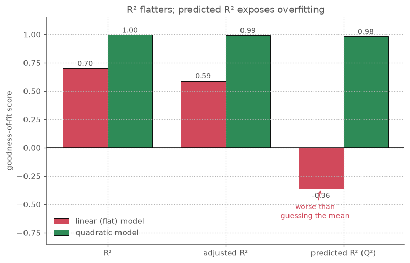

The visual lesson is that the three metrics disagree _most_ exactly where it matters. A model
that is overfitting looks fine on R², slightly worse on adjusted R², and is only unmasked by the
cross-validated predicted R². Reading only the first bar would have sent you to the bench with a
flat model and a wrong optimum.

A healthy fit shows all three R² values **close together and high**. A large gap between R²
and predicted R² is the warning that you have over-fit: the model is describing this particular
plate's noise, not the underlying biology, and its "optimum" may not reproduce.

**Takeaway.** Never select a model on R² alone — it is the metric that can only flatter you.
Let adjusted R² guard against needless terms and predicted R² (Q²) prove the model can predict
wells it has not seen. Together they are the difference between a model that _fits_ and a model
you can _act on_.

---

## Part V — Locating and balancing the optimum

*Pin the optimum down exactly, and reconcile readouts that pull against each other.*

### Vignette 12 — From contour to coordinates: the optimum, exactly

**Concept: analytic optimisation of the fitted surface.** In Vignette 7 we _read_ the optimum
off the contour map (and confirmed it with `result.optimum()`). That works, but it is still a
numerical search. Once you have a quadratic fit the optimum has a closed form — and the same
algebra tells you something the picture can't: whether that point is a genuine peak, a valley,
or a saddle.

A second-order model is `ŷ = b₀ + xᵀb + xᵀB x`, where `b` collects the linear coefficients and
`B` is the curvature matrix (squared terms on its diagonal, half the interactions off it).
Setting the gradient to zero gives the **stationary point** `x_s = −½ B⁻¹ b` directly.

```python
from doe import stationary_point

# res_ccd is the quadratic fit from Vignette 7
sp = stationary_point(res_ccd)
print(sp.coded)       # [0.7429 0.8867]   (coded units)
print(sp.natural)     # {'dna_ng': 448.6, 'lipid_uL': 2.387}
print(sp.response)    # 67.10   -- predicted % GFP+ at the optimum
print(sp.kind)        # 'maximum'
print(sp.eigenvalues) # [-10.30  -4.65]
```

This lands on the same well Vignette 7's constrained optimiser found (~448 ng DNA, ~2.39 µL lipid,
~67% GFP+) — but as an exact solution, decoded into pipette units, in one call.

**Canonical analysis: is it actually a peak?** The `kind` and `eigenvalues` come from the
_canonical analysis_ — the eigen-decomposition of the curvature matrix `B`. The signs of the
eigenvalues classify the stationary point:

- **all negative → a maximum** (a dome — what you want when maximising a readout),
- **all positive → a minimum** (a bowl),
- **mixed signs → a saddle** (a mountain pass: rising one way, falling another — there is no
  single best point, and you should optimise _along_ the rising direction).

Here both eigenvalues are negative, so the surface is a true dome and `x_s` is its peak — the
statistical confirmation of the "both squared terms are negative" reading from Vignette 7.

**The figure: a 3-D surface plot.** `surface_plot` is the companion to the contour map — the
same fitted surface, drawn as a landscape you can see the dome in directly.

```python
from doe.plotting import surface_plot
ax = surface_plot(res_ccd, "dna_ng", "lipid_uL")
```


The surface climbs from ~30% GFP+ at low DNA/low lipid (front, dark) to a bright ridge near
high DNA/high lipid (back, ~67%), bending over into the dome whose peak the stationary point
pinned down. It is the Vignette 7 contour map with the height axis made literal.

**When the peak is outside the box: the constrained optimum.** The stationary point is
_unconstrained_ — the algebra doesn't know your factor limits. If the true peak lies beyond
the range you tested, `x_s` falls outside the coded `[-1, +1]` box and is not a setting you can
pipette. `optimum` handles that: it searches the surface _within_ the box and flags whether the
best feasible point sits on a boundary.

```python
from doe import optimum

# res_rep is a quadratic fit for a luciferase reporter readout still climbing at
# the top of the tested DNA range, on the same CCD factors as res_ccd.

stationary_point(res_rep).coded   # [1.90  0.29]  -- dna coded 1.90 is *outside* [-1, 1]
opt = optimum(res_rep, maximize=True)
print(opt.coded)      # [1.00  0.27]   -- clamped to the high-DNA edge
print(opt.natural)    # {'dna_ng': 500.0, 'lipid_uL': 1.769}
print(opt.at_bound)   # True
```

`at_bound=True` is the message that matters: your best feasible setting is pressed against a
limit (here the top of the DNA range). The model's true peak is past where you pipetted, so
this is a cue to run a follow-up that **extends the DNA range upward** rather than trusting
500 ng as the answer. For the well-behaved Vignette 7 dome, by contrast, `optimum(res_ccd)`
returns the interior stationary point with `at_bound=False` — the optimum is real, not an
artefact of where you stopped looking.

**Takeaway.** `stationary_point` gives the optimum in closed form _and_ tells you what kind of
point it is; `optimum` keeps you honest about your factor bounds. An interior maximum with
`at_bound=False` is a result you can act on; a boundary optimum is an invitation to widen the
design.

---

### Vignette 13 — Two readouts at once: desirability

**Concept: multi-response optimisation.** Real assay development almost never optimises a
single number. You want high transfection **and** healthy cells; a bright reporter **and** low
background. These goals usually pull in opposite directions — cranking DNA lifts %GFP+ but
stresses the cells — so "the optimum" is a _compromise_, and where you strike it is a choice
you should make explicitly, not by squinting at two contour plots side by side.

The **desirability** approach (Derringer–Suich) makes the trade-off quantitative. Each response
is mapped onto a **desirability** `dᵢ` between 0 (unacceptable) and 1 (ideal) via a goal —
maximise, minimise, or hit a target — over a range you specify. The overall desirability is
their **geometric mean** `D = (∏ dᵢ)^(1/m)`. The geometric mean is the crux: if _any_ response
is unacceptable (`dᵢ = 0`), `D` collapses to 0 — so a setting that nails GFP but kills the cells
scores zero, exactly as it should. `desirability` then finds the factor settings that maximise
`D` over the design box.

```python
from doe import ResponseGoal, desirability

# res_ccd  : the %GFP+ quadratic from Vignette 7 (more DNA helps, up to the dome's peak)
# res_viab : a % viable-cell readout on the same CCD (falls as DNA rises -- toxicity)
goals = [
    ResponseGoal(res_ccd,  goal="max", low=40.0, high=70.0),   # want %GFP+ toward 70
    ResponseGoal(res_viab, goal="max", low=50.0, high=90.0),   # want viability toward 90
]
des = desirability(goals)

print(des.natural)     # {'dna_ng': 311.3, 'lipid_uL': 1.920}
print(des.responses)   # response_1  62.4  (predicted %GFP+)
                        # response_2  78.2  (predicted % viable)
print(des.individual)  # response_1  0.748  (GFP+ desirability)
                        # response_2  0.705  (viability desirability)
print(des.overall)     # 0.726          -- geometric-mean D
```

Each `ResponseGoal` says "for this response, desirability ramps from 0 at `low` to 1 at
`high`." With both goals set to `max`, the optimiser looks for settings that push _both_
readouts up their ramps together. `des.responses`/`des.individual` are indexed by each goal's
response label; `res_ccd`/`res_viab` were fitted from bare arrays rather than named response
columns (see the [two-readout walkthrough](WORKFLOW2.md) for the named form), so they fall
back to the positional labels `response_1`/`response_2` in goal order — `response_1` is the
%GFP+ fit, `response_2` the viability fit. The answer here is **~311 ng DNA, ~1.92 µL lipid**
— a middle-of-the-range DNA amount giving a predicted **62% GFP+ at 78% viability**, with both
individual desirabilities healthy (~0.7) and an overall `D` of 0.73.

**Why not just maximise GFP?** Because the readouts conflict. Optimising %GFP+ _alone_ (the
Vignette 12 result) drives DNA to ~449 ng for ~67% GFP+ — but read the viability surface at
that same well and it has dropped to ~65%. Desirability deliberately gives back a few points of
GFP (67 → 62) to buy a large gain in viability (65 → 78), because the geometric mean rewards
keeping _both_ acceptable over maxing one out. That balance — not the single-response peak — is
usually the setting that actually reproduces and scales.

**The figure: the compromise, mapped.** The plot below is the _combined_ desirability `D`
drawn as a contour map over DNA and lipid — one surface that already folds both readouts
together. Bright yellow is where `D` is highest: where %GFP+ and viability are _both_ good.


The two markers tell the whole story. The **gold star** is the desirability optimum
(~311 ng DNA, `D` ≈ 0.73), sitting squarely on the bright plateau. The **red X** is the
GFP-only optimum from Vignette 12 (~449 ng DNA) — and notice it has slid _off_ the plateau
into a duller band, because the extra DNA that maximised GFP has started to cost viability.
Optimising GFP alone walks you to the X; desirability walks you to the star. The star is not
where either single readout peaks — it is where their _product_ does, which is exactly the
setting most likely to survive a scale-up.

Tuning the trade-off is just editing the goals: tighten viability's `low` to refuse anything
below, say, 70% viable; add a `weight > 1` to a `ResponseGoal` to make its ramp steeper (insist
on getting closer to ideal); or switch a goal to `"target"` with a `target=` value when you want
a response _at_ a set point rather than as high as possible.

**Takeaway.** With more than one readout, don't optimise them one at a time and hope. State each
goal, let desirability find the compromise that keeps them all acceptable, and read the
trade-off it struck — explicitly, in the units you pipette.

---

## Part VI — Running the experiment

*Get the runs onto plates in an order that protects you from the plate itself.*

### Vignette 14 — Run order: randomise to protect yourself

**Concept: randomisation.** Plates drift. The first columns you pipette sit in reagent
longer; the incubator has a thermal gradient; cells settle in the tube as you dispense. If
you run conditions in a tidy, _sorted_ order, any such **lurking trend** lines up with a
factor and masquerades as that factor's effect. **Randomising the run order** breaks that
alignment — a time/position drift becomes noise spread across all factors rather than a
fake effect on one.

```python
design = central_composite([dna, lipid], center=4)
plate_order = design.randomize(seed=42)   # shuffles runs; records original 'std_order'
print(plate_order.runs.head())            # pipette in *this* order
#    std_order  dna_ng  lipid_uL
# 0          0   100.0       0.5
# 1          7   300.0       2.5
# 2          6   300.0       0.5
# 3          9   300.0       1.5
# 4         11   300.0       1.5
```

Note the `std_order` column is no longer `0, 1, 2, 3, …`: that is the original design-row
index, carried along so you can re-join readouts back to the design after pipetting in the
shuffled physical order. (Rows 3–4 here, `std_order` 9 and 11, are two of the center
replicates that ended up adjacent — randomisation does not avoid that, and shouldn't.)

The shuffled design keeps a `std_order` column so you can map each well back to its design
row when you enter readouts. Randomise the **physical layout** you pipette, then re-join to
the design for analysis.

**The figure: how randomisation breaks confounding.** The picture below makes the danger and
the fix concrete. In each panel the grey dashed line is a **lurking drift** — anything that
changes steadily across the run order (reagent sitting longer, an incubator gradient, cells
settling in the tube). The bars are each run's coded DNA level. On the **left**, the plate is
run _sorted by DNA_: every low-DNA well is pipetted first, every high-DNA well last, so DNA's
level climbs in lockstep with the drift — `corr(drift, DNA) = +0.92`. Any signal the drift
produces will be credited to DNA; the two are **confounded**, and the model can't tell them
apart. On the **right**, the same runs in **randomised** order: DNA levels are scattered
across the timeline, the correlation collapses to `+0.00`, and the drift no longer masquerades
as a DNA effect — it just adds a little noise, spread across every factor.

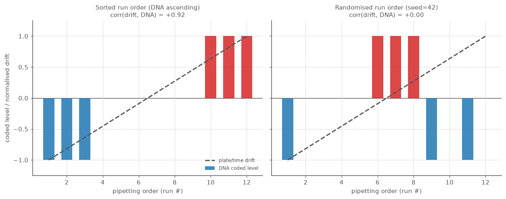

That collapse from +0.92 to ~0 is the entire point of randomising. You cannot remove the
drift — plates drift — but you can stop it from lining up with a factor, which turns a _bias_
you would never notice into _variance_ you can see and account for.

**Takeaway.** Design _what_ to run with a factorial/RSM; randomise _the order you run it in_.
The first protects you from interactions and curvature; the second protects you from the
plate itself.

---

### Vignette 15 — Sharing the design: interactive HTML

**Concept: a self-contained, explorable view of the design.** Every figure so far has been a
PNG of an _analysis_. But before any wells are filled, the design itself is worth looking at —
and worth handing to a colleague who doesn't run Python. `to_html` writes the whole design to a
single, self-contained HTML file: one row per run, in both the natural units you pipette and the
coded `±1` units the maths uses, colour-coded so the structure is obvious at a glance. Apply it to
a _randomised_ design (Vignette 14) and you get a ready-to-use bench **run sheet**.

```python
from doe import ContinuousFactor, central_composite, to_html

dna   = ContinuousFactor("dna_ng",   100, 500, units="ng/well")
lipid = ContinuousFactor("lipid_uL", 0.5, 2.5, units="uL/well")
ccd   = central_composite([dna, lipid], alpha="faced", center=4)

# randomise the run order, then export the run sheet
plate_order = ccd.randomize(seed=42)
plate_order.name = "Transfection CCD - randomised run sheet"

# returns the HTML string and (optionally) writes it to a file
to_html(plate_order, path="docs/example_design.html")
```

Open the result in any browser ([example output](example_design.html)). It is sortable,
searchable and pageable (via DataTables, loaded from a CDN), with two pieces of colour doing the
work:

- The **coded columns** carry a diverging blue→white→red scale, so the factorial corners (deep
  blue `−1` / deep red `+1`), the axial points, and the centre (white `0`) are visually distinct
  — you can _see_ the CCD's structure without reading a single number.
- When the design tracks point types (as a CCD does), the **`type` column is tinted** — centre
  replicates in amber, axial runs in blue — so the run categories the lack-of-fit test relies on
  (Vignette 6) are obvious.

The `run` column is the **pipetting order** (1, 2, 3 …). For a randomised design a **`std_order`**
column appears alongside it, carrying each well's original design-row index — so after you pipette
in the shuffled physical order you can re-join your readouts back to the design (exactly the
mapping introduced in Vignette 14).

A few practical notes:

- It adds **no Python dependencies** — the table and colouring are emitted directly, not via
  `DataFrame.style` (which needs `jinja2`) or matplotlib.
- Pass `cdn=False` for a fully offline file (a static styled table with no external assets), or
  `coded=False` to show natural units only.
- The output is just a string when you omit `path`, so you can embed it in a report or a
  notebook (`IPython.display.HTML(to_html(plate_order))`).

**Takeaway.** `to_html` turns a `Design` into something you can _share and explore_, not just a
DataFrame you print. It is the bridge between designing an experiment and walking it over to the
bench.

---

## Part VII — Evaluating and generating designs

*Judge a design before you run it — and build a custom one when the named recipes do not fit.*

### Vignette 16 — Reading a design's alias structure

**Concept: check aliasing _before_ you run.** Vignette 4 traded away the ability to resolve some
interactions to save runs, and Vignette 5 showed Plackett–Burman's tangled "complex aliasing".
Both are decisions you want to _see_ before committing wells — which terms can this design estimate
independently, and which are confounded? `correlation_heatmap` answers that for **any** design, and
`alias_matrix` is its headless, numeric core.

The clearest illustration is the half-fraction from Vignette 4. Name the factors `A`–`D` so the
term labels line up with the generator `D=ABC`:

```python
from doe import ContinuousFactor, fractional_factorial
from doe.plotting import alias_matrix, correlation_heatmap

demo = fractional_factorial(
    [ContinuousFactor(c, 0.0, 1.0) for c in "ABCD"], generators=["D=ABC"]
)

labels, corr = alias_matrix(demo, interactions=True)   # term names + correlation matrix
idx = {name: i for i, name in enumerate(labels)}
for left, right in [("A:B", "C:D"), ("A:C", "B:D"), ("A:D", "B:C")]:
    print(f"{left} = {right}: r = {corr[idx[left], idx[right]]:+.0f}")
# A:B = C:D: r = +1
# A:C = B:D: r = +1
# A:D = B:C: r = +1

ax = correlation_heatmap(demo, interactions=True)
```

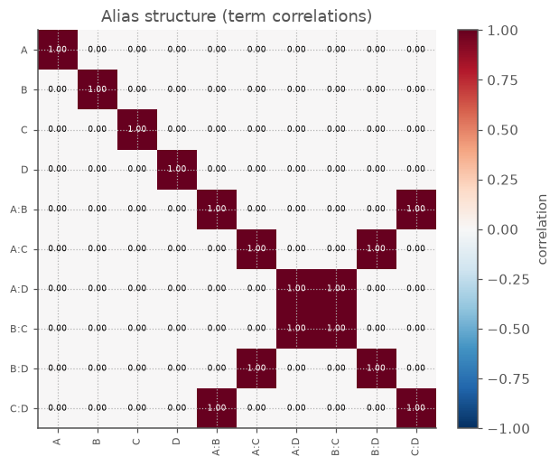

How to read it:

- The **diagonal is always 1** (each term correlates perfectly with itself). The interesting
  information is _off_ the diagonal.
- **Main effects** (`A`–`D`) show `0` everywhere off the diagonal — they are mutually orthogonal and
  estimated independently, exactly what the factorial geometry buys you.
- The three bright **off-diagonal cells** are the price of the fraction: `A:B` is perfectly
  correlated (`r = 1`) with `C:D`, `A:C` with `B:D`, `A:D` with `B:C`. Those interaction pairs are
  _confounded_ — the model literally cannot tell them apart, so a significant `A:B` term might
  really be `C:D`. Knowing this _before_ you run tells you which follow-up runs would de-alias them.

A few notes:

- It reads straight from a `Design` (pre-analysis), and `order`/`interactions` pick which model's
  aliasing to assess — the same knobs as `fit_ols`/`build_model_matrix`. It handles categorical
  factors too (via their effect-coded contrast columns).
- Pass `absolute=True` for `|r|` on a sequential scale — handy for spotting _any_ aliasing
  regardless of sign on a busy design (this is the form Vignette 5 uses for Plackett–Burman).
- For an orthogonal design (a full factorial, or a Plackett–Burman's main effects) the off-diagonal
  is all zeros — a clean diagonal is the picture of "everything estimable independently".

**Takeaway.** Aliasing is a property of the _design_, knowable before a single well is filled.
`correlation_heatmap` makes it a one-glance check: a clean diagonal means orthogonal; bright
off-diagonal cells are confounded terms you should know about before you commit reagents.

---

### Vignette 17 — Is this design good enough?

**Concept: design diagnostics before you run.** By now we have several ways to make designs:
factorials, fractional screens, Plackett–Burman, CCDs, Box-Behnken. Before committing wells, it is
useful to ask a separate question: **how well can this particular design estimate the model I plan
to fit?** Phase 3 adds numeric diagnostics for exactly that.

For the CCD from Vignette 7, judge it against the same quadratic model:

```python
from doe import condition_number, efficiency, vif
from doe.plotting import leverage_plot

# ccd/res_ccd are the design and quadratic fit from Vignette 7
diag = efficiency(ccd, order=2, interactions=True)
print(f"D={diag.d:.3f}, A={diag.a:.3f}, G={diag.g:.3f}, I={diag.i:.3f}")
# D=0.408, A=0.324, G=0.632, I=0.574

print(condition_number(res_ccd.model_matrix))
# 3.13

for name, value in vif(res_ccd.model_matrix, term_names=res_ccd.term_names).items():
    print(f"{name:>16s}: {value:.2f}")
#           dna_ng: 1.00
#         lipid_uL: 1.00
#  dna_ng:lipid_uL: 1.00
#         dna_ng^2: 1.12
#       lipid_uL^2: 1.12

ax = leverage_plot(res_ccd)
```

How to read those numbers:

- **D/A/G/I efficiencies** are compact summaries of how much information the design carries for
  the chosen model. Higher is better; they are most useful for comparing candidate designs on the
  same factor region and model.
- **Condition number** flags unstable columns. Here ~3 is tame; very large values mean some model
  terms are nearly redundant.
- **VIF** asks whether one term is inflated by correlation with the others. Values near 1 are the
  reassuring case; the CCD's main effects and interaction are orthogonal, and even the squared
  terms are only mildly coupled.

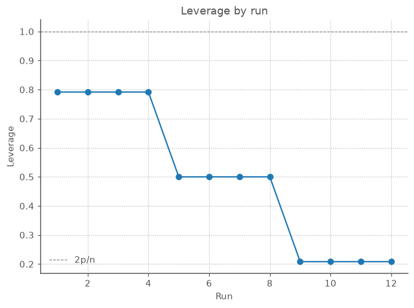

The **leverage plot** shows how much influence each run has on the fitted model. Center
replicates have low leverage because they repeat the same setting; edge and axial points carry
more geometric information. A run above the `2p/n` guide line deserves attention: it may be
essential, but if that well fails it can pull the model around.

**Takeaway.** Diagnostics turn "this looks like a standard design" into a checkable statement:
the terms are estimable, the geometry is stable, and no single well is quietly dominating the
fit.

---

### Vignette 18 — When recipes don't fit: optimal designs

**Concept: computer-generated designs.** Named recipes are excellent when their assumptions fit
your assay. But real constraints are messier: "I only have eight wells", "this reagent has three
levels", "those combinations are impossible", or "I already ran four corners — what four wells
should I add?" Phase 3 adds **optimal designs** for those cases. You define a candidate set of
allowed runs, pick a model, and let the exchange engine choose the most informative subset.

Here is an 8-run quadratic design over a 5×5 DNA/lipid candidate grid. A full 5×5 grid would cost
25 wells; the optimal design picks only eight.

```python
from doe import candidate_grid, d_optimal, i_optimal
from doe import efficiency

region = candidate_grid([dna, lipid], levels=5)

d_design = d_optimal(
    [dna, lipid], n_runs=8, model="quadratic", region=region, seed=1, n_restarts=50
)
i_design = i_optimal(
    [dna, lipid], n_runs=8, model="quadratic", region=region, seed=1, n_restarts=50
)

print(d_design.runs)
#    dna_ng  lipid_uL
# 0   500.0       0.5
# 1   300.0       1.5
# 2   100.0       0.5
# 3   500.0       2.5
# 4   500.0       1.5
# 5   100.0       2.5
# 6   300.0       0.5
# 7   100.0       1.5

d_eff = efficiency(d_design, order=2, interactions=True, region=region)
i_eff = efficiency(i_design, order=2, interactions=True, region=region)
print(f"D-optimal: D={d_eff.d:.3f}, I={d_eff.i:.3f}")
print(f"I-optimal: D={i_eff.d:.3f}, I={i_eff.i:.3f}")
# D-optimal: D=0.454, I=0.576
# I-optimal: D=0.454, I=0.587
```

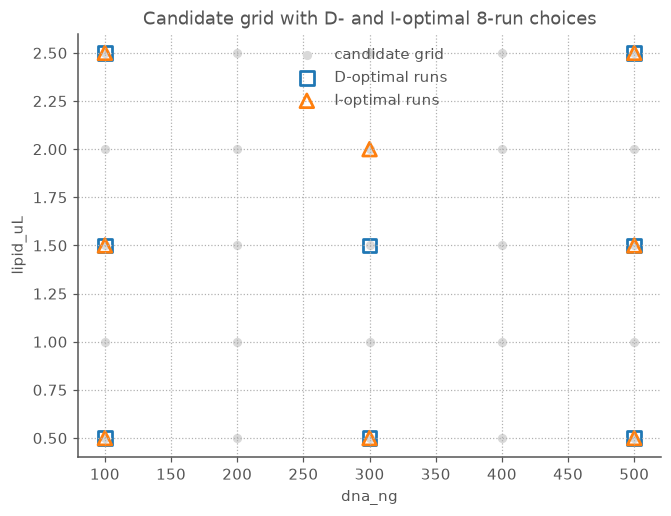

The grey dots are all allowed candidate runs; the markers are the chosen wells. **D-optimality**
spreads runs to estimate coefficients precisely overall. **I-optimality** shifts the choice to
reduce average prediction variance across the region. The two designs can look similar, but the
criterion is different: compare them on a shared region with `efficiency(...).i`, not by comparing
their stored scores directly.

Optimal design also handles the common "add a few more wells" workflow:

```python
from doe import augment, full_factorial

base = full_factorial([dna, lipid])       # the four corners already run
augmented = augment(base, n_runs=4, model="quadratic", seed=2)
print(augmented.runs)
#    dna_ng  lipid_uL
# 0   100.0       0.5
# 1   100.0       2.5
# 2   500.0       0.5
# 3   500.0       2.5
# 4   300.0       1.5
# 5   300.0       2.5
# 6   300.0       0.5
# 7   100.0       1.5
print(augmented.point_types)
# ('existing', 'existing', 'existing', 'existing', 'augment', 'augment', 'augment', 'augment')
```

The original rows stay at the front, tagged `"existing"`, and only the new rows are searched.

Finally, candidate regions can mix continuous factors with categorical ones. Categorical levels
are handled as discrete choices, then reported back as labels:

```python
from doe import CategoricalFactor

reagent = CategoricalFactor("reagent", ("PEI", "Lipo", "FuGENE"))
mixed = d_optimal([dna, reagent], n_runs=6, model="linear", seed=4)
print(mixed.runs)
#    dna_ng reagent
# 0   100.0     PEI
# 1   500.0    Lipo
# 2   500.0     PEI
# 3   100.0    Lipo
# 4   100.0  FuGENE
# 5   500.0  FuGENE
```

That is useful when "factorised" bench choices matter: reagent brand, plate coating, media
formulation, transfection chemistry. The model still uses proper effect coding internally; you
keep reading and writing natural labels.

**Takeaway.** Optimal designs are the custom design tool: give the library the feasible menu of
runs, the model you want to estimate, and the run budget you can afford. It returns a normal
`Design`, so all the fitting, diagnostics and plotting tools above still apply.

---

### Vignette 19 — Mapping a space without assuming its shape: space-filling designs

**Concept: coverage instead of a model.** Every design so far — factorial, CCD, Box-Behnken,
optimal — is built to estimate a _specific_ model efficiently. A CCD puts runs at the corners,
the axials and the centre precisely because that is where a _quadratic_ needs data. But
sometimes you don't want to commit to a model shape up front:

- the response might be **wiggly** — a plateau, a shoulder, two peaks — not a tidy dome;
- you plan to fit something **flexible** (a spline, a Gaussian-process surrogate, an ML model)
  that learns the shape from the data rather than assuming it;
- you are running an **expensive simulation** or an _in-silico_ screen and simply want to sample
  the region evenly before deciding anything.

For these the goal flips: not "estimate these coefficients precisely" but **"cover the region
uniformly, leaving no large gaps."** That is a **space-filling design**.

The naïve way to cover a box is to scatter random points — and it is worse than intuition
suggests: random points **clump and leave holes**. A regular **grid** avoids clumps but wastes
its resolution, because a 4×4 grid only ever tries **four** distinct DNA levels; if DNA turns out
to be the factor that matters, you spent sixteen wells learning about four doses. Space-filling
designs thread the needle — the same sixteen wells, spread evenly, with sixteen _distinct_ levels
on every axis.

```python
import numpy as np
from doe import ContinuousFactor, latin_hypercube, sobol, discrepancy

dna   = ContinuousFactor("dna_ng",   100, 500, units="ng/well")
lipid = ContinuousFactor("lipid_uL", 0.5, 2.5, units="uL/well")

lhs   = latin_hypercube([dna, lipid], n_runs=16, seed=0)
sob   = sobol([dna, lipid], n_runs=16, seed=0)
```

**The figure: four ways to place sixteen points.** The panels below show the _same_ box sampled
four ways, each titled with its **discrepancy** — a single number measuring how far the cloud is
from perfectly uniform (lower is better; introduced properly below).

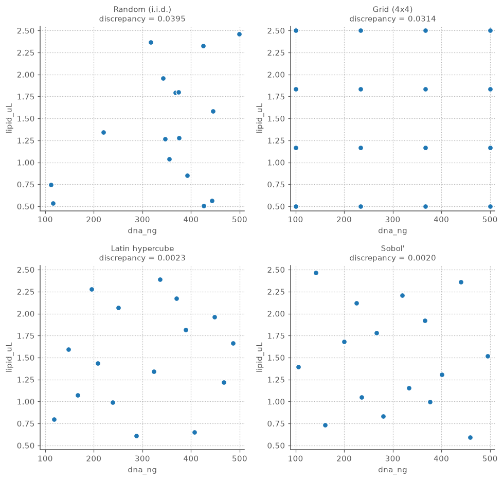

Read left-to-right, top-to-bottom. **Random** clumps (see the near-touching pair in the middle)
and leaves a bare patch bottom-left — discrepancy 0.0395, the worst. The **grid** is perfectly
regular but visibly commits to only four DNA levels and four lipid levels. **Latin hypercube** and
**Sobol'** fill the plane evenly with no clumps and no holes, and their discrepancies (0.0023 and
0.0020) are an **order of magnitude** lower than random's. Those two are the designs you want.

**Latin hypercube: one point per stratum.** The "Latin" trick is simple and powerful. Split each
factor's range into `n_runs` equal **strata** and place exactly one point in each — so every
factor, _projected onto its own axis_, is perfectly evenly spread, no matter how many factors
there are.

```python
lhs8 = latin_hypercube([dna, lipid], n_runs=8, seed=1)
print(lhs8.runs)
#        dna_ng  lipid_uL
# 0  252.060013  1.360171
# 1  102.923534  1.678099
# 2  391.595058  1.140592
# 3  327.853564  1.851922
# 4  202.267714  0.735126
# 5  449.711736  2.218780
# 6  487.115702  0.905230
# 7  153.438392  2.465137
print(lhs8.meta)
# {'sampler': 'lhs', 'criterion': 'maximin', 'seed': 1}
```

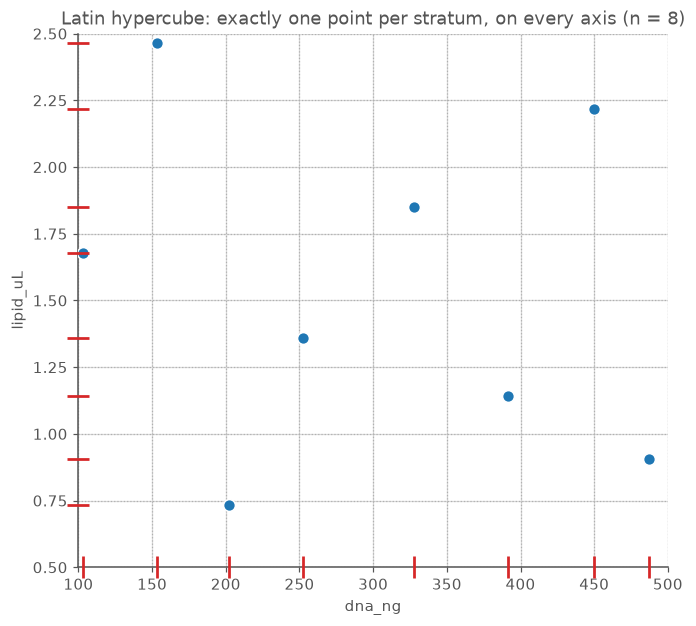

The faint gridlines cut the box into 8 strata per axis. The **red rug ticks** on the bottom and
left margins are the giveaway: there is exactly **one tick in every column and every row** — one
point per stratum, on each axis. That one-dimensional uniformity is guaranteed for _any_ run
count, which is why LHS scales to many factors and odd budgets where a grid cannot (a grid would
need `mᵏ` runs). The default `criterion="maximin"` goes one step further, drawing several valid
hypercubes and keeping the one whose points are most spread apart in the _full_ space — reducing
the residual clumping that pure stratification still allows. Pass `criterion="correlation"` to
instead minimise cross-factor correlation, or `criterion=None` for the plain stratified draw. The
design is reproducible and self-describing: `meta` records the sampler, criterion and seed.

**Sobol' and Halton: low-discrepancy sequences.** `sobol` and `halton` are the other route —
_deterministic_ (then randomly scrambled) sequences engineered so every sub-region gets its fair
share of points. Unlike a fresh random draw, they get **better as you add points**: each new
point plugs the biggest current gap. `sobol` achieves its balance guarantees only in blocks of
`2ᵐ`, so it insists on a power-of-two run count; `halton` takes any count and is the escape hatch
when your budget isn't a power of two.

```python
sobol([dna, lipid], n_runs=20)
# ValueError: sobol requires a power-of-two n_runs; got 20 (nearest valid sizes: 16, 32)
```

**Judging coverage: two model-free metrics.** Because there is no model to score, space-filling
designs are judged by how well they _cover_ the region. Two diagnostics do that, both operating on
the design rescaled to the unit cube — so they judge **any** design, not just these (you can ask
how well a CCD covers its box, too):

- **`discrepancy`** — how far the cloud is from perfectly uniform. **Lower is better.**
- **`maximin_distance`** — the distance between the _closest_ pair of runs. **Larger is better**:
  it means no two wells sit wastefully on top of each other.

```python
from doe import maximin_distance
#            design   discrepancy   maximin_distance
#   random (i.i.d.)        0.0395             0.0153
#        grid (4×4)        0.0314             0.3333
#   Latin hypercube        0.0023             0.1404
#           Sobol'         0.0020             0.1332
```

The two numbers measure genuinely different things, and the grid row shows why you want both.
Random is worst on _both_ — its clumping crushes the maximin distance to 0.015 (that near-touching
pair) and its holes inflate discrepancy. The **grid** actually wins maximin (0.333 — its points
are maximally separated) yet has poor discrepancy, because even separation is not the same as even
_coverage_ when you are stuck on four levels per axis. **LHS and Sobol'** get the best of both: an
order-of-magnitude lower discrepancy than random while keeping points well separated.

**The figure: coverage improves faster for low-discrepancy sequences.** The payoff of Sobol'/Halton
over random shows up as you scale up. This plots discrepancy against run count (three factors,
averaged over seeds) on log-log axes:

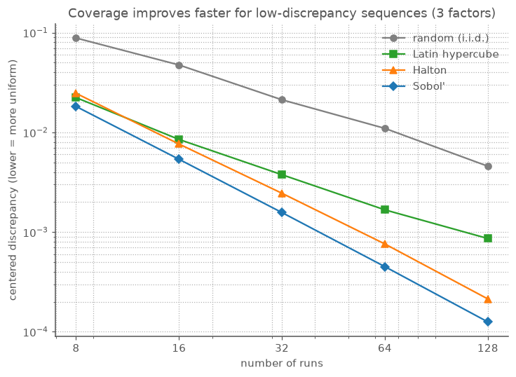

```python
#      n    random       lhs    halton     sobol
#      8    0.0884    0.0223    0.0246    0.0182
#     16    0.0474    0.0085    0.0076    0.0054
#     32    0.0212    0.0038    0.0025    0.0016
#     64    0.0110    0.0017    0.0008    0.0005
#    128    0.0046    0.0009    0.0002    0.0001
```

Every method improves with more runs, but at different _rates_. Random discrepancy falls slowly
(roughly like `1/√n`); the low-discrepancy sequences fall much faster (closer to `1/n`), so the
gap **widens** with budget — by 128 runs Sobol' is ~40× more uniform than random. Latin hypercube
sits in between: better than random everywhere, but Sobol'/Halton pull ahead as `n` grows. The
practical rule: **LHS** when you want guaranteed one-per-stratum projections and any run count;
**Sobol'** (power-of-two) when you want the most uniform fill and may extend the sample later;
**Halton** when you want Sobol'-like coverage at an arbitrary count.

Everything downstream is unchanged: a space-filling design is an ordinary `Design`, so once the
wells are read out you fit, diagnose and plot exactly as in every vignette above — the difference
is only that you laid the runs down to _map_ the space rather than to fit a preordained curve.

**Takeaway.** When you know the model shape, spend runs where that model needs them (factorial,
CCD, optimal). When you _don't_ — an unknown or wiggly surface, a flexible surrogate, an
exploratory simulation — spread runs to cover the region: `latin_hypercube` for stratified
coverage at any budget, `sobol`/`halton` for the most uniform fill, and `discrepancy` /
`maximin_distance` to prove the coverage is good.

---

### Vignette 20 — When the factors are proportions: mixture designs

Every design so far has varied factors _independently_ over a box: DNA and lipid could each be
set high or low without regard to the other. But some experiments aren't like that. Blend three
co-solvents for a coating and their proportions **must sum to 1** — push water up and something
else has to come down. The response depends only on the _blend_, not the total amount. The design
region is no longer a box; it's a triangle (a **simplex**), and the modelling changes with it.

A `MixtureFactor` is a proportion in `[0, 1]`. The classic support is the **simplex-lattice**
design — every blend on a `1/m` grid:

```python
from doe import MixtureFactor, simplex_lattice

solvents = [MixtureFactor("water"), MixtureFactor("ethanol"), MixtureFactor("acetone")]
simplex_lattice(solvents, degree=2).runs
#    water  ethanol  acetone
# 0    0.0      0.0      1.0
# 1    0.0      0.5      0.5
# 2    0.0      1.0      0.0
# 3    0.5      0.0      0.5
# 4    0.5      0.5      0.0
# 5    1.0      0.0      0.0
```

Six runs: the three **pure** blends (a vertex each) and the three binary **50/50** blends (an
edge midpoint each) — every row summing to 1. The related `simplex_centroid(solvents)` adds the
overall centroid and gives `2³ − 1 = 7` runs (each non-empty subset of components blended
equally). Both tag runs via `point_types` (`"vertex"`, `"edge-centroid"`, `"centroid"`), so a
replicated centroid drives lack-of-fit exactly as center points do in a box design.

**Fitting: Scheffé blending models.** Because the proportions sum to 1, an intercept would be
perfectly confounded with the sum of the linear terms — so mixture models _drop the intercept_
and fit **Scheffé polynomials**: `ŷ = Σ βᵢxᵢ` (linear) or `+ ΣΣ βᵢⱼxᵢxⱼ` (quadratic). `fit_ols`
recognises an all-mixture design; the `"scheffe-linear"` / `"scheffe-quadratic"` model names make
the intent explicit:

```python
result = fit_ols(meas, gloss, model="scheffe-quadratic")
for name, coef in zip(result.term_names, result.coefficients):
    print(f"{name!r}: {coef:+.2f}")
# 'water': +39.88
# 'ethanol': +55.50
# 'acetone': +60.58
# 'water:ethanol': -25.59
# 'water:acetone': -0.59
# 'ethanol:acetone': +36.71
#
# R^2 = 0.9999
# model matrix has no intercept column: True
```

Read them as _blending_ coefficients: a linear term is the response of the **pure** component
(pure acetone ≈ 60), and a positive cross term is **synergy** (ethanol + acetone blend higher than
either alone, `+36.7`), a negative one **antagonism** (water sours an ethanol blend, `−25.6`). The
factorial "effect" (the −1→+1 swing) has no meaning on proportions, so `FitResult.effects` is
`NaN` for a mixture fit — a deliberate signal, not a bug.

**Which terms are real?** As in Vignette 10, a large coefficient isn't automatically a significant
one. `anova_table` works on a mixture fit, following the textbook mixture convention: the `k`
linear terms collapse into a single **Linear blending** row (`k − 1` df), then one 1-df row per
cross product:

```python
result.anova().round(3)   # the fluent form of anova_table(result, meas, gloss)
#                       SS   df       MS         F      p
# Linear blending  482.269  2.0  241.134  4114.405  0.011
# water:ethanol     35.389  1.0   35.389   603.836  0.026
# water:acetone      0.250  1.0    0.250     4.263  0.287
# ethanol:acetone   64.282  1.0   64.282  1096.831  0.019
# Residual           0.059  1.0    0.059       NaN    NaN
# Total            582.249  6.0      NaN       NaN    NaN
```

The two blends the coefficients called out are both significant (`ethanol:acetone` synergy
`p ≈ 0.019`, `water:ethanol` antagonism `p ≈ 0.026`), while the near-zero `water:acetone` cross
term (`−0.59`) is _not_ (`p ≈ 0.29`) — exactly what a `−0.6` coefficient on a 40-to-60 surface
should be: noise.

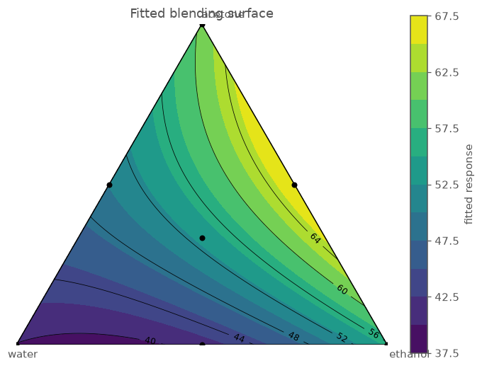

`ternary_contour(result, design)` draws the fitted surface over the triangle — each corner a pure
component, each edge a binary blend — and overlays the design points. The optimum is read straight
off it: gloss climbs toward the ethanol–acetone edge, away from the water corner, just as the
coefficients said. `ternary_grid` — the headless core the plot draws — hands back the sampled
composition points and their fitted response, so the best blend can be pulled out numerically
rather than eyeballed:

```python
from doe.plotting import ternary_grid
import numpy as np

x, y, z, points = ternary_grid(result, resolution=200)
best = points[int(np.argmax(z))]
print(f"water={best[0]:.2f}, ethanol={best[1]:.2f}, acetone={best[2]:.2f} -> gloss={z.max():.1f}")
# water=0.00, ethanol=0.43, acetone=0.57 -> gloss=67.4
```

No water at all, and a roughly 43/57 ethanol–acetone split — squarely on the high edge the contour
picked out.

**Constrained regions and odd budgets.** Real formulations carry bounds — "water at least 30%,
acetone at most 50%". That clips the simplex to a smaller polygon, and the lattice/centroid recipes
no longer apply; `extreme_vertices` enumerates the corners of the constrained region (plus its
centroid):

```python
constrained = [
    MixtureFactor("water", low=0.30, high=1.0),
    MixtureFactor("ethanol", low=0.0, high=0.60),
    MixtureFactor("acetone", low=0.0, high=0.50),
]
extreme_vertices(constrained).runs   # 5 vertices + the region centroid, each summing to 1
```

And for an arbitrary run budget, the constrained candidate set feeds Phase 3's optimal-design
engine directly — `d_optimal(solvents, n_runs=7, model="quadratic", region=mixture_candidates(solvents))`
returns a seven-run D-optimal blend set whose rows still sum to 1 (the engine exchanges whole
candidate points, so the constraint is preserved by construction).

**Takeaway.** When the factors are _proportions of a whole_, reach for the mixture family:
`simplex_lattice` / `simplex_centroid` for the unconstrained triangle, `extreme_vertices` for a
bounded region, `fit_ols(..., model="scheffe-quadratic")` for the blending model, and
`ternary_contour` to see and locate the best blend.

---

## Where to go next

| You want to…                                  | Reach for…                                           | Part |
| --------------------------------------------- | ---------------------------------------------------- | ---- |
| Quantify main effects & interactions          | `full_factorial` + `fit_ols` + `pareto_plot` / `interaction_plot` | I |
| See which factors matter (cheap, many inputs) | `fractional_factorial` / `plackett_burman` + `half_normal_plot` | II |
| Locate an optimum on a curved surface         | `central_composite` / `box_behnken` + `contour_plot` | III |
| Test whether effects are real, not just big   | `FitResult.anova`, `FitResult.conf_int`              | IV |
| Check the model is trustworthy                | `residuals_vs_fitted`, `normal_qq`, `predicted_vs_actual`, `FitResult.lack_of_fit` | IV |
| Guard against over-fitting (choose a model)   | `FitResult.adjusted_r2`, `FitResult.predicted_r2` (Q²), `FitResult.press` | IV |
| Pinpoint & classify the optimum exactly       | `stationary_point` (canonical analysis), `surface_plot` | V |
| Find the best _feasible_ setting in bounds    | `optimum` (reports `at_bound`)                       | V |
| Balance several readouts at once              | `desirability` + `ResponseGoal`                      | V |
| Guard against plate drift                     | `Design.randomize`                                   | VI |
| Share/explore a design as interactive HTML    | `to_html`                                            | VI |
| Check a design's aliasing before running      | `correlation_heatmap`, `alias_matrix`                | VII |
| Judge design quality before running           | `efficiency`, `vif`, `condition_number`, `leverage_plot` | VII |
| Generate a custom run set under constraints   | `candidate_grid`, `d_optimal`, `i_optimal`, `augment` | VII |
| Cover a region evenly (no assumed model shape) | `latin_hypercube`, `sobol`, `halton` + `discrepancy`, `maximin_distance` | VII |
| Design & fit a blend whose parts sum to 1     | `simplex_lattice` / `simplex_centroid` / `extreme_vertices` + `fit_ols(model="scheffe-quadratic")` + `ternary_contour` | VII |

Every example above runs in coded units internally but is entered and reported in the real
units you set at the bench — nanograms, microlitres, percent. That is the whole point: the
statistics stay rigorous while you keep thinking in pipette terms.
