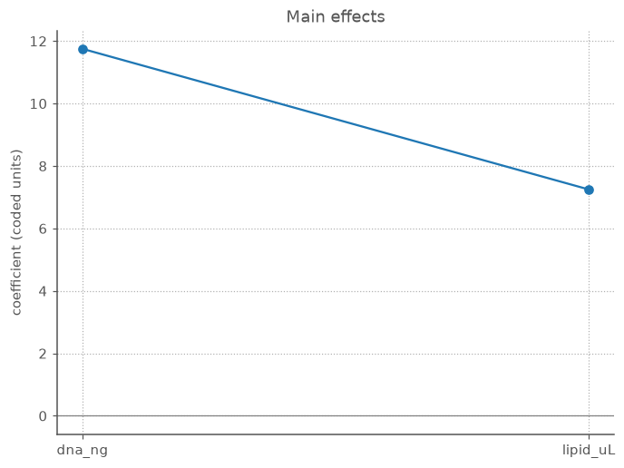
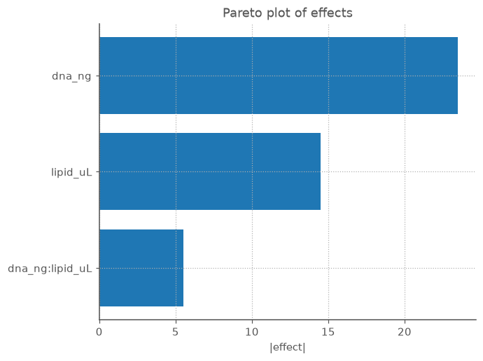
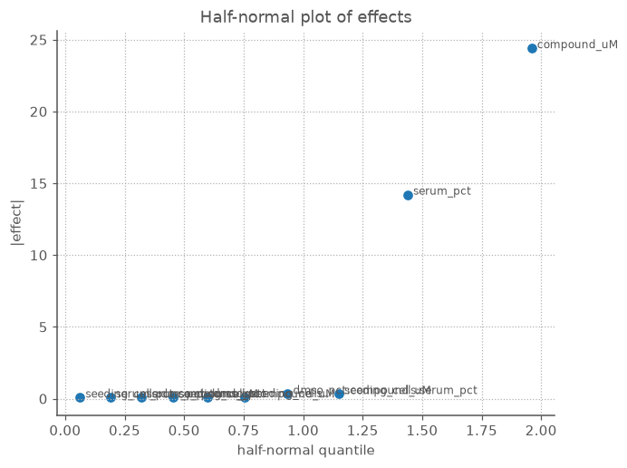
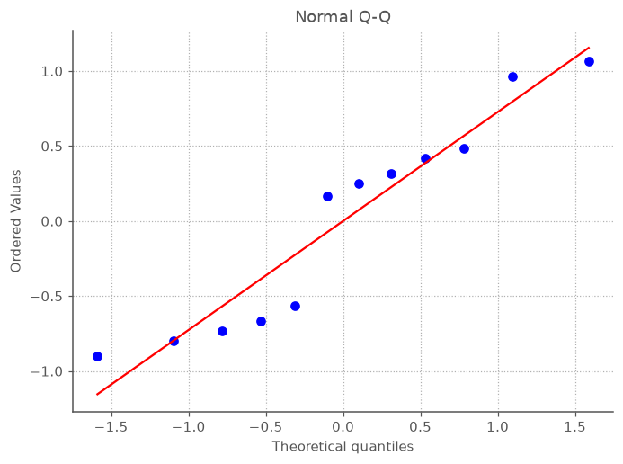
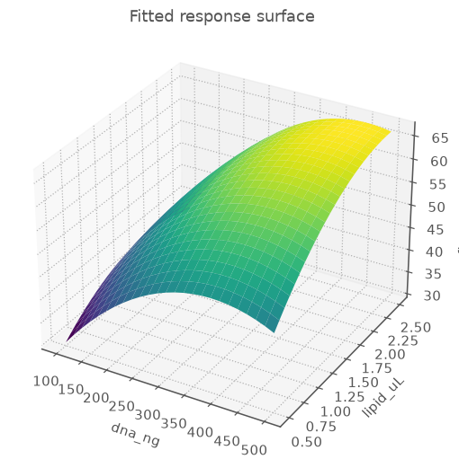

# DoE vignettes for cell-based experiments

A guided tour of design-of-experiments (DoE) ideas, written for a molecular biologist
who runs cell-based assays at the bench. Each vignette pairs a concept with a worked
example using this library and a note on the figure you would look at.

The running scenario is one most wet-lab scientists recognise: **optimising a transient
transfection** in adherent cells, and a couple of neighbouring assays (viability, a
reporter readout). The factors are things you actually pipette and set on an incubator.

> Conventions used throughout
>
> - A **factor** is an input you control (DNA amount, serum %, time). A **response** (or
>   _readout_) is what you measure (% GFP+, luminescence, viable-cell count).
> - Continuous factors are modelled in **coded units**: the low setting is `-1`, the high
>   setting is `+1`, and the midpoint is `0`. This is just a rescaling — it makes effects
>   directly comparable and the maths well-behaved. You always _enter_ and _read out_ real
>   ("natural") units; the library does the translation.
> - An **effect** is the change in the readout when you move a factor from `-1` to `+1`
>   (i.e. across its whole tested range). In coded units an effect is exactly twice the
>   regression coefficient — useful to remember when reading a model.
>
> Every console output and figure below is real: it is produced by running the snippets
> via `scripts/build_vignette_assets.py`, which writes the figures to `docs/img/`. The
> readouts in Vignettes 5–12 use a synthetic-but-realistic dome surface so the examples are
> fully reproducible; swap in your own plate data and the same calls apply.

---

## Vignette 1 — Why not change one thing at a time?

**Concept: OFAT vs. factorial.** The instinct at the bench is _one factor at a time_
(OFAT): fix everything, titrate DNA, pick the best, then fix DNA and titrate lipid. It
feels careful. It has two failure modes:

1. **It is blind to interactions.** If the best DNA amount _depends_ on how much lipid you
   use (it usually does — they form the complex together), OFAT can walk you to a local
   sweet spot and call it the global one.
2. **It is wasteful.** Every run spent holding a factor constant tells you nothing about
   that factor.

A **factorial design** varies factors _together_, in a structured grid, so every run
informs every effect. With two factors at two levels each, the full factorial is just the
four corners of a square:

```python
from doe import ContinuousFactor, full_factorial

dna   = ContinuousFactor("dna_ng",   low=100, high=500, units="ng/well")
lipid = ContinuousFactor("lipid_uL", low=0.5, high=2.5, units="uL/well")

design = full_factorial([dna, lipid], levels=2)
print(design.runs)
#    dna_ng  lipid_uL
# 0   100.0       0.5
# 1   100.0       2.5
# 2   500.0       0.5
# 3   500.0       2.5
```

Four wells (plus replicates) buy you both main effects **and** their interaction. The
same four numbers under OFAT would give you main effects only, and only along the edges
you happened to walk.

**Takeaway.** Factorial designs are not just "more conditions" — they are a _geometry_
that makes each well do double duty. Everything else in this guide builds on that grid.

---

## Vignette 2 — Coded units and main effects

**Concept: coding, and reading a main effect.** Suppose you ran the 2×2 above in
triplicate and measured % GFP-positive cells. Fit a linear model and look at the effects.

```python
import numpy as np
from doe import ContinuousFactor, full_factorial, fit_ols

dna   = ContinuousFactor("dna_ng",   100, 500)
lipid = ContinuousFactor("lipid_uL", 0.5, 2.5)
design = full_factorial([dna, lipid], levels=2)   # the 4 corners

# triplicate readout (% GFP+), three wells per corner; replace with real plate data
gfp = np.array([22, 20, 24,    # low DNA,  low lipid
                31, 29, 33,    # low DNA,  high lipid
                40, 38, 42,    # high DNA, low lipid
                58, 60, 62])   # high DNA, high lipid

# replicate each condition 3x (consecutively) to line up with the triplicates above.
# `each=True` keeps a condition's replicates together; the default repeats the whole
# design instead. Prefer this over stacking the runs frame by hand -- it can't misalign.
rep = design.replicate(3, each=True)

result = fit_ols(rep, gfp, model="linear")
print(result.summary())
# {term: (coefficient, effect)}
# {
#     'Intercept'      : (38.25, 38.25),
#     'dna_ng'         : (11.75, 23.5),
#     'lipid_uL'       : (7.25, 14.5),
#     'dna_ng:lipid_uL': (2.75, 5.5)
#}
```

How to read it:

- The **intercept** is the predicted readout at the _center_ of the design (coded `0,0`) —
  here, the grand mean, ~38% GFP+.
- The **`dna_ng` effect** (~+23.5) is how much %GFP+ changes as DNA goes from 100 → 500 ng,
  _averaged over_ the lipid settings: "more DNA, more signal across the board."
- The **`lipid_uL` effect** (~+14.5) is the analogous swing for lipid.

Because everything is in coded units, the effects are on a common footing: a factor with a
bigger |effect| moves the readout more across its tested range, regardless of whether its
natural units are nanograms or microlitres.

**The figure: a main-effects plot.** `main_effects_plot(result)` draws each main-effect
coefficient as a point against a zero line. Steeper / further-from-zero points are the
factors that matter. It is the first plot to look at after a screen — it answers "which
knobs actually do anything?" at a glance.

```python
from doe.plotting import main_effects_plot
ax = main_effects_plot(result)
```



Both points sit well above zero, with `dna_ng` (~+11.75) the steeper of the two — DNA is
the bigger knob here, lipid the secondary one. (Recall the plot shows _coefficients_; the
effects you read in the table are twice these.)

---

## Vignette 3 — The thing OFAT misses: interactions

**Concept: interaction effects.** Look again at the GFP numbers. Going from low to high
lipid adds ~+9 points _at low DNA_ (22→31) but ~+20 points _at high DNA_ (40→60). The
benefit of lipid **depends on** the DNA level. That dependence is the **interaction**, and
a factorial design estimates it directly:

```python
result = fit_ols(rep, gfp, model="linear")   # 'linear' here includes 2-factor interactions
coef, eff = result.summary()["dna_ng:lipid_uL"]
print(eff)   # +5.5 -- the dna x lipid interaction effect (coded units)
```

A non-trivial `dna_ng:lipid_uL` term is the biology you would have missed with OFAT:
DNA and lipid co-titrate because they form the transfection complex together; the optimum
is a _ridge_, not a point on one axis.

How to read an interaction effect: it is _half the difference of the two slopes_. If lipid
helps a lot at high DNA and only a little at low DNA, the interaction is large and positive.
When an interaction is present, **you cannot talk about a factor's "best" level without
naming the other factor's level** — which is exactly why one-at-a-time tuning misleads.

**The figure: a Pareto plot of effects.** `pareto_plot(result)` sorts every term
(main effects and interactions) by |effect| as a horizontal bar chart. It tells you, in
rank order, where the signal is — and whether an interaction bar is tall enough to take
seriously next to the main effects.

```python
from doe.plotting import pareto_plot
ax = pareto_plot(result)
```



The ranking is unambiguous: `dna_ng` (|effect| ≈ 23.5) > `lipid_uL` (≈ 14.5) >
`dna_ng:lipid_uL` (≈ 5.5). The interaction bar is the short one at the bottom — real and
worth keeping, but a fraction of the mains. That ordering is exactly the story the numbers
told; the bar chart just makes "is the interaction big enough to care about?" a one-glance
call.

---

## Vignette 4 — Screening: which of _many_ factors matter?

**Concept: fractional factorials.** Early in assay development you often have a long list of
suspects: seeding density, serum %, DMSO %, compound concentration, incubation time,
passage number. A full factorial in 6 factors at 2 levels is `2^6 = 64` corner conditions —
before replicates. That is a lot of plate real estate to spend on factors that may not
matter.

A **fractional factorial** runs a cleverly chosen _fraction_ of those corners. You give up
the ability to resolve some high-order interactions (you _alias_ them — deliberately
confound a term you believe is negligible with one you care about), in exchange for far
fewer runs. It is the workhorse **screening** design: cast a wide net cheaply, find the 2–3
factors that dominate, then study those properly.

```python
from doe import ContinuousFactor, fractional_factorial

A = ContinuousFactor("seeding_cells", 5_000,  20_000, units="cells/well")
B = ContinuousFactor("serum_pct",     2,      10,     units="%")
C = ContinuousFactor("dmso_pct",      0.1,    1.0,    units="%")
D = ContinuousFactor("compound_uM",   0.1,    10,     units="uM")

# half-fraction of a 2^4: 8 runs instead of 16. D is aliased with the A*B*C interaction.
design = fractional_factorial([A, B, C, D], generators=["D=ABC"])
print(design.n_runs)   # 8
print(design.coded())
#    seeding_cells  serum_pct  dmso_pct  compound_uM
# 0           -1.0       -1.0      -1.0         -1.0
# 1           -1.0       -1.0       1.0          1.0
# 2           -1.0        1.0      -1.0          1.0
# 3           -1.0        1.0       1.0         -1.0
# 4            1.0       -1.0      -1.0          1.0
# 5            1.0       -1.0       1.0         -1.0
# 6            1.0        1.0      -1.0         -1.0
# 7            1.0        1.0       1.0          1.0
```

Eight wells, run once each (no replication — that is the point of a screen). Suppose the
measured readout came back like this; fit a linear model and rank the effects:

```python
import numpy as np
from doe import fit_ols

# one viability-proxy readout per run (no replicates -> saturated model, but we only
# need the effect *sizes* to spot the hits)
y = np.array([31.0, 55.2, 68.8, 44.5, 54.7, 30.4, 45.0, 69.8])
result = fit_ols(design, y, model="linear")

# rank terms by |effect|
for name, (coef, eff) in sorted(
    result.summary().items(), key=lambda kv: -abs(kv[1][1])
):
    if name != "Intercept":
        print(f"{name:>28s}: {eff:+.2f}")
#                  compound_uM: +24.40
#                    serum_pct: +14.20
#      seeding_cells:serum_pct: +00.33
#         dmso_pct:compound_uM: +00.33
#                seeding_cells: +00.10
#                     dmso_pct: +00.10
#    seeding_cells:compound_uM: +00.08
#           serum_pct:dmso_pct: +00.08
#        serum_pct:compound_uM: +00.07
#       seeding_cells:dmso_pct: +00.07
```

Two effects (`compound_uM`, `serum_pct`) tower over a floor of near-zero terms — those
near-zero terms are the inert factors and aliased interactions, all just noise. That is the
signal a half-normal plot is built to make obvious.

The string `"D=ABC"` is the **generator**: it _defines_ the fourth factor's column as the
product of the first three. That is the price of the fraction — `D`'s main effect shares a
column with the three-way `A·B·C` interaction. Three-way interactions are rarely real in a
cell assay, so this is usually a safe trade.

**The figure: a half-normal plot of effects.** `half_normal_plot(result)` plots the
_absolute_ effects against half-normal quantiles. The idea: if a factor is pure noise, its
effect is a draw from a normal centred on zero, and the inert effects fall on a straight
line through the origin. The **real** factors are the points that jump _off_ that line to
the upper right. It is the classic "which effects are signal vs. noise?" read for a screen
with little or no replication.

```python
from doe.plotting import half_normal_plot
ax = half_normal_plot(result)   # labelled points; the ones off the line are your hits
```



`compound_uM` and `serum_pct` sit high and to the right, clearly detached from the dense
cluster of inert terms hugging the bottom-left (those overlapping labels at |effect| ≈ 0
are seeding density, DMSO, and every aliased interaction — pure noise). Two real factors
out of four, found in eight wells. Those are the two to take forward into a response-surface
study.

---

## Vignette 5 — Replication, center points, and "is it just curved?"

**Concept: center points and pure error.** Two-level designs only ever sample the _corners_,
so they can fit a _plane_ (mains + interactions) but can't see **curvature** — the very
common situation where a readout rises, peaks, then falls (too little compound does nothing;
too much is toxic). Adding **center points** — replicate runs at the dead middle of every
factor — fixes two things at once:

1. **Replication gives you pure error.** Several wells at _identical_ settings differ only by
   experimental noise. That spread is your **pure-error** yardstick — the irreducible
   well-to-well variability, estimated without trusting any model.
2. **Center points detect curvature.** If the average readout at the center sits well off the
   average of the corners, the surface is bowed, and a flat (first-order) model is
   inadequate.

The **lack-of-fit test** formalises (2): it compares the variation the model _fails_ to
explain against pure error. A _non-significant_ lack-of-fit (large p) means "the model is
adequate — its misses are no bigger than plate noise." A _significant_ one says "there's
structure here your model isn't capturing" — usually a cue to add quadratic terms.

```python
import numpy as np
from doe import ContinuousFactor, central_composite, fit_ols
from doe.analysis import lack_of_fit

dna   = ContinuousFactor("dna_ng",   100, 500)
lipid = ContinuousFactor("lipid_uL", 0.5, 2.5)

# a CCD includes replicated center points by default (here: 4 of them)
design = central_composite([dna, lipid], center=4)
print(design.n_runs, design.n_center)   # 12 4

# measured % GFP+, one value per run (this is the same readout used in Vignette 6).
# Runs 8-11 are the four center-point replicates: 60.0, 59.1, 60.9, 60.8 -- nearly
# identical, and their spread *is* the pure-error estimate.
y = np.array([30.3, 37.0, 46.8, 66.9, 38.0, 60.7,
              47.1, 60.7, 60.0, 59.1, 60.9, 60.8])
result = fit_ols(design, y, model="quadratic")
lof = lack_of_fit(result, design, y)
print(f"F = {lof.f_stat:.3f}, p = {lof.p_value:.4f}")   # F = 1.583, p = 0.3576
```

A p-value of **0.36** is comfortably large: the model's misses are no bigger than the
well-to-well noise the center replicates revealed, so the quadratic surface is adequate. A
small p here (say < 0.05) would have been the cue that real structure is escaping the model.

**Rule of thumb.** Always salt a design with a few center-point replicates. They cost a
handful of wells and buy you both an honest noise estimate and an early warning that you
need a curved model.

---

## Vignette 6 — Response surfaces: finding the optimum, not just the direction

**Concept: response-surface methodology (RSM).** Screening tells you _which_ factors matter
and _which direction_ helps. To actually **locate an optimum** — the DNA:lipid ratio that
maximises transfection without tipping into toxicity — you need a model with curvature: a
**quadratic** (second-order) surface. That requires factors at **three or more levels**,
which is what response-surface designs provide.

The **central composite design (CCD)** is the standard choice. It is a 2-level factorial
_core_ (the corners), plus **axial / star points** that stick out along each axis (to
estimate the squared terms), plus center replicates (pure error, as above):

```python
from doe import ContinuousFactor, central_composite, fit_ols

dna   = ContinuousFactor("dna_ng",   100, 500)
lipid = ContinuousFactor("lipid_uL", 0.5, 2.5)

# "faced" keeps every run inside your stated low/high bounds (no extrapolation),
# which is convenient when the bounds are real pipetting/biology limits.
design = central_composite([dna, lipid], alpha="faced", center=4)

y = np.array([30.3, 37.0, 46.8, 66.9, 38.0, 60.7,
              47.1, 60.7, 60.0, 59.1, 60.9, 60.8])   # measured % GFP+ per run
result = fit_ols(design, y, model="quadratic")
print(result.summary())
# {term: (coefficient, effect)}
# {
#     'Intercept':        (59.83,  59.83),
#     'dna_ng':           (11.52,  23.03),
#     'lipid_uL':         ( 6.73,  13.47),
#     'dna_ng:lipid_uL':  ( 3.35,   6.70),
#     'dna_ng^2':         (-9.75, -19.50),
#     'lipid_uL^2':       (-5.20, -10.40)
# }
print(f"R^2 = {result.r_squared:.4f}")   # R^2 = 0.9966
```

The fitted quadratic has main effects, the interaction, **and** `dna_ng^2`, `lipid_uL^2`
terms. Both squared terms are **negative** — they bend the surface into a dome, and a dome
has a peak. (If they had come back near zero, the surface would be a tilted plane and the
"optimum" would just be a corner — a sign you should widen the factor ranges.)

**The figure: a contour plot.** This is the payoff visualisation. `contour_plot(result, "dna_ng", "lipid_uL")`
draws the fitted surface as a topographic map in **natural units**: filled bands of
predicted readout with labelled contour lines. You _read the optimum straight off it_ —
the centre of the innermost ring — and, just as usefully, you see the _shape_: a tight bullseye
means the optimum is finicky; a long diagonal ridge means many DNA:lipid combinations work
equally well (and you should pick the cheapest/most robust point on the ridge).

```python
from doe.plotting import contour_plot
ax = contour_plot(result, "dna_ng", "lipid_uL")
```


Read it like a topographic map: the bright yellow island in the upper right (high DNA, high
lipid) is the predicted optimum, and the contour rings nest around it. The bands are not
concentric circles but tilted ovals — that tilt is the `dna_ng:lipid_uL` interaction made
visible (the two reagents co-titrate). The "65" ring is broad rather than a tight bullseye,
which is good news: a range of high-DNA/high-lipid combinations land near the peak, so you
have room to pick a robust, pipettable setting rather than chasing one finicky point.

When you want the numbers rather than the picture, ask the fit for its optimum directly —
`result.optimum()` runs a constrained search over the design box and reports the best point
in natural units (no manual grid scan):

```python
opt = result.optimum()            # maximize over the coded box by default
print(opt)
# Optimum(max: dna_ng=448.6, lipid_uL=2.387 -> 67.1)

print(f"predicted optimum: {opt.natural['dna_ng']:.0f} ng DNA, "
      f"{opt.natural['lipid_uL']:.2f} uL lipid -> {opt.response:.1f}% GFP+")
# predicted optimum: 449 ng DNA, 2.39 uL lipid -> 67.1% GFP+
```

So the model's best guess is ~449 ng DNA with ~2.39 µL lipid for ~67% GFP+. The
`opt.at_bound` flag is `False` here, which is the reassuring case: the optimum sits in the
interior of the design region, not pinned to an edge. Combined with `alpha="faced"` (every
run stayed inside your stated bounds), this optimum is an _interpolation_ you can trust — not
an extrapolation past where you actually pipetted. If `at_bound` were `True`, the surface
would still be climbing at the edge of where you explored, and the "optimum" would really be
a signpost to run a follow-up design shifted in that direction.

For an unconstrained view — the surface's true stationary point plus a canonical analysis
classifying it as a maximum, minimum, or saddle — use `result.stationary_point()`. And when
you need the raw grid (e.g. to feed your own plotting), `contour_plot`'s underlying
`surface_grid(result, "dna_ng", "lipid_uL")` is still there.

**More than two factors?** Hold the others fixed and slice. With a third factor (say serum
%), `surface_grid(result, "dna_ng", "lipid_uL", fixed={"serum_pct": 10})` shows the DNA×lipid
surface _at_ 10% serum; change the fixed value to see how the landscape shifts.

---

## Vignette 7 — Trusting the model: diagnostics before decisions

**Concept: residual diagnostics.** A model can have a beautiful R² and still be lying to
you — a missed curvature, a single toxic outlier well, or variance that grows with signal.
Before you commit reagents to the "optimum," check the **residuals** (observed − fitted).
Two quick plots catch most problems.

**Residuals vs. fitted.** `residuals_vs_fitted(result)` scatters each residual against its
fitted value, with a line at zero. You want a **structureless cloud** centred on zero. What
the patterns mean at the bench:

- A **funnel** (residuals fan out as fitted values grow) → variance scales with signal;
  consider a log transform of the readout (common for luminescence/fluorescence).
- A **U or arch** → systematic curvature the model missed; add quadratic terms (Vignette 6).
- **One point far out** → a suspect well (edge effect, a bubble, a pipetting slip). Check the
  plate map before trusting or discarding it.

```python
from doe.plotting import residuals_vs_fitted
ax = residuals_vs_fitted(result)   # uses the Vignette 6 quadratic fit
```


This is what "healthy" looks like: residuals scatter in a roughly even band around zero
across the whole fitted range (~30 to ~67% GFP+), with no funnel and no arch. The points
bunched near a fitted value of ~60 are the four center replicates — their tight vertical
spread is the pure-error noise the lack-of-fit test in Vignette 5 leaned on. Nothing here
argues for a transform or extra terms.

**Normal Q-Q.** `normal_qq(result)` plots the ordered residuals against normal quantiles.
If the noise is roughly Gaussian (the assumption behind the p-values and confidence
intervals), the points hug the diagonal. Heavy tails or a strong S-curve mean the
significance calls are on shaky ground.

```python
from doe.plotting import normal_qq
ax = normal_qq(result)
```



The points track the red reference line closely, with only mild wander at the tails (normal
for a 12-run design) — no strong S-curve, no points flung far off the line. The Gaussian-noise
assumption behind the p-values and confidence intervals holds, so the significance calls from
the fit can be trusted.

**Takeaway.** Diagnostics are cheap insurance. Two plots stand between a tidy summary table
and a wasted confirmation experiment.

---

## Vignette 8 — Big vs. real: ANOVA and significance

**Concept: significance testing.** Every vignette so far has ranked terms by the _size_ of
their effect. But size alone can mislead: a large effect estimated from noisy wells may be a
fluke, while a modest one measured cleanly may be rock-solid. To separate "big" from
"trustworthy" you need the **standard error** of each estimate — and that needs spare runs.
A design with more runs than model terms has **residual degrees of freedom**, and those let
you compute p-values and confidence intervals. (This is exactly what the saturated screen in
Vignette 4 lacked: 8 runs, 8 terms, zero spare — so it could only rank effect _sizes_, never
test them. The CCD from Vignettes 5–6 has 12 runs for a 6-term model, leaving 6 residual
degrees of freedom — enough to do statistics.)

The **ANOVA table** partitions the total variation in the readout into a piece for each term
plus a leftover **residual**. Each term's mean square is compared (an **F-ratio**) against
the residual: a large F — and the small p-value that goes with it — means that term explains
far more variation than noise alone would.

```python
from doe.analysis import anova_table

# res_ccd is the quadratic fit from Vignette 6
tbl = anova_table(res_ccd, design, y)
print(tbl)
#                    SS  df     MS      F          p
# dna_ng          795.8   1  795.8  880.4  9.716e-08
# lipid_uL        272.0   1  272.0  301.0  2.351e-06
# dna_ng:lipid_uL  44.9   1   44.9   49.7  4.083e-04
# dna_ng^2        395.6   1  395.6  437.7  7.769e-07
# lipid_uL^2       72.1   1   72.1   79.8  1.099e-04
# Residual          5.4   6    0.9    NaN        NaN
# Total          1586.0  11    NaN    NaN        NaN
```

Every term clears significance comfortably (all p < 0.001): the two main effects, the
interaction, _and_ both quadratic terms are real, not artefacts. Note how small the
`Residual` SS (5.4) is next to the term SS — the model captures almost all the variation, the
numerical echo of the R² ≈ 0.997 from Vignette 6.

The companion view is a **confidence interval** on each coefficient. `result.conf_int(0.95)`
returns a two-sided interval per term; an interval that excludes zero is the same verdict as
"p < 0.05," but it also tells you _how precisely_ the effect is pinned down.

```python
ci = result.conf_int(0.95)   # (n_terms, 2): [low, high] per coefficient
# coefficient (not effect) and its 95% CI:
#   dna_ng         : 11.52   CI [10.57, 12.47]
#   lipid_uL       :  6.73   CI [ 5.78,  7.68]
#   dna_ng:lipid_uL:  3.35   CI [ 2.19,  4.51]
#   dna_ng^2       : -9.75   CI [-11.18, -8.33]
#   lipid_uL^2     : -5.20   CI [-6.63, -3.78]
```

None of these intervals straddle zero, so every term earns its place. The negative quadratic
intervals (both entirely below zero) are the statistical confirmation of the dome from
Vignette 6: the downward curvature that gives the surface a peak is not an accident of the
fit.

**Takeaway.** Rank by effect size to _find_ candidates; test with ANOVA / confidence intervals
to _keep_ them. The price of admission is spare runs — design in a few more than your model
has terms, and significance testing comes for free.

---

## Vignette 9 — How much model is too much? Adjusted and predicted R²

**Concept: overfitting and model parsimony.** Plain **R²** has a fatal flaw for choosing
between models: it _never goes down_ when you add a term. Throw in enough interactions and
powers and R² marches toward 1.0 — even if the extra terms are fitting noise. Two corrected
versions keep you honest:

- **Adjusted R²** penalises each added term, so it only rises when a new term explains more
  than a random one would. It rewards _parsimony_.
- **Predicted R²** (also called **Q²**) is the real test of _generalisation_. It is built from
  the **PRESS** statistic: refit the model leaving out each run in turn, predict that
  held-out run, and accumulate the errors. A model that merely memorised its own data — rather
  than learning the surface — predicts left-out points badly, and predicted R² collapses (it
  can even go _negative_, meaning "worse than guessing the mean").

The cleanest demonstration is to fit the _wrong_ model to the Vignette 6 dome data — a flat
(linear) model that ignores curvature — and compare it to the right (quadratic) one:

```python
from doe.analysis import adjusted_r2, predicted_r2, press

res_lin  = fit_ols(design, y, model="linear")     # flat: no squared terms
res_quad = fit_ols(design, y, model="quadratic")  # the Vignette 6 fit

#               R²      adj R²    pred R²    PRESS
# linear      0.7017    0.5898    -0.3591   2155.3
# quadratic   0.9966    0.9937     0.9835     26.2
```

Read across the rows. The flat model's R² of 0.70 looks passable — but its **predicted R² is
_negative_** (−0.36): asked to predict a well it hadn't seen, it does worse than just guessing
the average. That is the signature of a model fighting curvature it has no terms for. The
quadratic model, by contrast, holds up under cross-validation (predicted R² ≈ 0.98), and its
PRESS is ~80× smaller — it genuinely _learned the dome_ rather than papering over it.

A healthy fit shows all three R² values **close together and high**. A large gap between R²
and predicted R² is the warning that you have over-fit: the model is describing this particular
plate's noise, not the underlying biology, and its "optimum" may not reproduce.

**Takeaway.** Never select a model on R² alone — it is the metric that can only flatter you.
Let adjusted R² guard against needless terms and predicted R² (Q²) prove the model can predict
wells it has not seen. Together they are the difference between a model that _fits_ and a model
you can _act on_.

---

## Vignette 10 — A leaner surface: Box-Behnken designs

**Concept: an alternative response-surface design.** The CCD in Vignette 6 finds an optimum
beautifully, but it has two awkward features. Its rotatable/circumscribed form places **axial
points outside the box** (you'd have to pipette beyond your stated limits), and even the faced
version runs the **extreme corners** — every factor at its high simultaneously. With three or
more factors, "all factors maxed at once" can be the well that's flat-out toxic, or simply
impossible (you can't have maximum DMSO _and_ maximum compound).

A **Box-Behnken design (BBD)** sidesteps both. It is a 3-level design that samples the
**midpoints of the edges** of the factor box plus center replicates — so it never sets all
factors to an extreme at the same time, and every run stays on a sphere comfortably inside the
corners. For three factors it needs just 15 runs (12 edge + 3 center) and still fits a full
quadratic.

```python
from doe import ContinuousFactor, box_behnken, fit_ols

dna   = ContinuousFactor("dna_ng",   100, 500)
lipid = ContinuousFactor("lipid_uL", 0.5, 2.5)
serum = ContinuousFactor("serum_pct", 2,  10, units="%")

design = box_behnken([dna, lipid, serum], center=3)
print(design.n_runs, design.n_center)   # 15 3
print(design.coded())
#     dna_ng  lipid_uL  serum_pct
# 0     -1.0      -1.0        0.0   <- a dna x lipid edge, serum held at center
# 1     -1.0       1.0        0.0
# 2      1.0      -1.0        0.0
# 3      1.0       1.0        0.0
# 4     -1.0       0.0       -1.0   <- a dna x serum edge, lipid at center
# ...
# 12     0.0       0.0        0.0   <- center replicates
# 13     0.0       0.0        0.0
# 14     0.0       0.0        0.0
```

Notice that **no row is all ±1** — every run holds at least one factor at its center. That is
the defining property: you never visit a corner. Fit the same quadratic model you would for a
CCD:

```python
y = np.array([30.0, 39.4, 47.2, 65.5, 30.7, 38.5, 53.6, 60.9,
              38.7, 44.2, 53.6, 59.9, 60.7, 59.9, 59.6])   # measured % GFP+ per run
result = fit_ols(design, y, model="quadratic")
print(result.summary())
# {
#   'Intercept':           (60.07,  60.07),
#   'dna_ng':              (11.07,  22.15),
#   'lipid_uL':            ( 7.29,  14.57),
#   'serum_pct':           ( 3.36,   6.73),
#   'dna_ng:lipid_uL':     ( 2.23,   4.45),
#   'dna_ng:serum_pct':    (-0.13,  -0.25),
#   'lipid_uL:serum_pct':  ( 0.20,   0.40),
#   'dna_ng^2':            (-8.86, -17.72),
#   'lipid_uL^2':          (-5.68, -11.37),
#   'serum_pct^2':         (-5.28, -10.57),
# }
print(f"R^2 = {result.r_squared:.4f}")   # R^2 = 0.9982
```

All three factors help, all three quadratics are negative (a dome in 3-D), and serum's two
interactions are negligible — serum acts independently here. With a third factor the surface
lives in 3-D, so to _see_ it you fix one factor and slice the other two (as introduced at the
end of Vignette 6):

```python
from doe.plotting import contour_plot
ax = contour_plot(result, "dna_ng", "lipid_uL", fixed={"serum_pct": 10})
```


This is the DNA×lipid landscape _at 10% serum_; change `fixed` to slice at a different serum
level and watch the whole surface lift or drop with serum's main effect.

**CCD or Box-Behnken?** Both fit the same quadratic. Reach for a **CCD** when you want the
corners (a factorial core you may already have run as a screen) or rotatability; reach for
**Box-Behnken** when corner combinations are infeasible or risky and you want to stay inside
the box with fewer runs. For three factors BBD is the economical, safe-by-construction choice.

---

## Vignette 11 — From contour to coordinates: the optimum, exactly

**Concept: analytic optimisation of the fitted surface.** In Vignette 6 we _read_ the optimum
off the contour map (and confirmed it with the argmax of a 101×101 grid). That works, but it
is eyeballing. Once you have a quadratic fit the optimum has a closed form — and the same
algebra tells you something the picture can't: whether that point is a genuine peak, a valley,
or a saddle.

A second-order model is `ŷ = b₀ + xᵀb + xᵀB x`, where `b` collects the linear coefficients and
`B` is the curvature matrix (squared terms on its diagonal, half the interactions off it).
Setting the gradient to zero gives the **stationary point** `x_s = −½ B⁻¹ b` directly.

```python
from doe import stationary_point

# res_ccd is the quadratic fit from Vignette 6
sp = stationary_point(res_ccd)
print(sp.coded)       # [0.7429 0.8867]   (coded units)
print(sp.natural)     # {'dna_ng': 448.6, 'lipid_uL': 2.387}
print(sp.response)    # 67.10   -- predicted % GFP+ at the optimum
print(sp.kind)        # 'maximum'
print(sp.eigenvalues) # [-10.30  -4.65]
```

This lands on the same well Vignette 6's grid search found (~448 ng DNA, ~2.39 µL lipid,
~67% GFP+) — but as an exact solution, decoded into pipette units, in one call.

**Canonical analysis: is it actually a peak?** The `kind` and `eigenvalues` come from the
_canonical analysis_ — the eigen-decomposition of the curvature matrix `B`. The signs of the
eigenvalues classify the stationary point:

- **all negative → a maximum** (a dome — what you want when maximising a readout),
- **all positive → a minimum** (a bowl),
- **mixed signs → a saddle** (a mountain pass: rising one way, falling another — there is no
  single best point, and you should optimise _along_ the rising direction).

Here both eigenvalues are negative, so the surface is a true dome and `x_s` is its peak — the
statistical confirmation of the "both squared terms are negative" reading from Vignette 6.

**The figure: a 3-D surface plot.** `surface_plot` is the companion to the contour map — the
same fitted surface, drawn as a landscape you can see the dome in directly.

```python
from doe.plotting import surface_plot
ax = surface_plot(res_ccd, "dna_ng", "lipid_uL")
```



The surface climbs from ~30% GFP+ at low DNA/low lipid (front, dark) to a bright ridge near
high DNA/high lipid (back, ~67%), bending over into the dome whose peak the stationary point
pinned down. It is the Vignette 6 contour map with the height axis made literal.

**When the peak is outside the box: the constrained optimum.** The stationary point is
_unconstrained_ — the algebra doesn't know your factor limits. If the true peak lies beyond
the range you tested, `x_s` falls outside the coded `[-1, +1]` box and is not a setting you can
pipette. `optimum` handles that: it searches the surface _within_ the box and flags whether the
best feasible point sits on a boundary.

```python
from doe import optimum

# a luciferase reporter readout still climbing at the top of the tested DNA range
res_rep = fit_ols(ccd, y_reporter, model="quadratic")

stationary_point(res_rep).coded   # [1.90  0.29]  -- dna coded 1.90 is *outside* [-1, 1]
opt = optimum(res_rep, maximize=True)
print(opt.coded)      # [1.00  0.27]   -- clamped to the high-DNA edge
print(opt.natural)    # {'dna_ng': 500.0, 'lipid_uL': 1.769}
print(opt.at_bound)   # True
```

`at_bound=True` is the message that matters: your best feasible setting is pressed against a
limit (here the top of the DNA range). The model's true peak is past where you pipetted, so
this is a cue to run a follow-up that **extends the DNA range upward** rather than trusting
500 ng as the answer. For the well-behaved Vignette 6 dome, by contrast, `optimum(res_ccd)`
returns the interior stationary point with `at_bound=False` — the optimum is real, not an
artefact of where you stopped looking.

**Takeaway.** `stationary_point` gives the optimum in closed form _and_ tells you what kind of
point it is; `optimum` keeps you honest about your factor bounds. An interior maximum with
`at_bound=False` is a result you can act on; a boundary optimum is an invitation to widen the
design.

---

## Vignette 12 — Two readouts at once: desirability

**Concept: multi-response optimisation.** Real assay development almost never optimises a
single number. You want high transfection **and** healthy cells; a bright reporter **and** low
background. These goals usually pull in opposite directions — cranking DNA lifts %GFP+ but
stresses the cells — so "the optimum" is a _compromise_, and where you strike it is a choice
you should make explicitly, not by squinting at two contour plots side by side.

The **desirability** approach (Derringer–Suich) makes the trade-off quantitative. Each response
is mapped onto a **desirability** `dᵢ` between 0 (unacceptable) and 1 (ideal) via a goal —
maximise, minimise, or hit a target — over a range you specify. The overall desirability is
their **geometric mean** `D = (∏ dᵢ)^(1/m)`. The geometric mean is the crux: if _any_ response
is unacceptable (`dᵢ = 0`), `D` collapses to 0 — so a setting that nails GFP but kills the cells
scores zero, exactly as it should. `desirability` then finds the factor settings that maximise
`D` over the design box.

```python
from doe import ResponseGoal, desirability

# res_ccd  : the %GFP+ quadratic from Vignette 6 (more DNA helps, up to the dome's peak)
# res_viab : a % viable-cell readout on the same CCD (falls as DNA rises -- toxicity)
goals = [
    ResponseGoal(res_ccd,  goal="max", low=40.0, high=70.0),   # want %GFP+ toward 70
    ResponseGoal(res_viab, goal="max", low=50.0, high=90.0),   # want viability toward 90
]
des = desirability(goals)

print(des.natural)     # {'dna_ng': 311.3, 'lipid_uL': 1.920}
print(des.responses)   # [62.4  78.2]   -- predicted (%GFP+, % viable) at that point
print(des.individual)  # [0.748  0.705] -- per-response desirabilities
print(des.overall)     # 0.726          -- geometric-mean D
```

Each `ResponseGoal` says "for this response, desirability ramps from 0 at `low` to 1 at
`high`." With both goals set to `max`, the optimiser looks for settings that push _both_
readouts up their ramps together. The answer here is **~311 ng DNA, ~1.92 µL lipid** — a
middle-of-the-range DNA amount giving a predicted **62% GFP+ at 78% viability**, with both
individual desirabilities healthy (~0.7) and an overall `D` of 0.73.

**Why not just maximise GFP?** Because the readouts conflict. Optimising %GFP+ _alone_ (the
Vignette 11 result) drives DNA to ~449 ng for ~67% GFP+ — but read the viability surface at
that same well and it has dropped to ~65%. Desirability deliberately gives back a few points of
GFP (67 → 62) to buy a large gain in viability (65 → 78), because the geometric mean rewards
keeping _both_ acceptable over maxing one out. That balance — not the single-response peak — is
usually the setting that actually reproduces and scales.

Tuning the trade-off is just editing the goals: tighten viability's `low` to refuse anything
below, say, 70% viable; add a `weight > 1` to a `ResponseGoal` to make its ramp steeper (insist
on getting closer to ideal); or switch a goal to `"target"` with a `target=` value when you want
a response _at_ a set point rather than as high as possible.

**Takeaway.** With more than one readout, don't optimise them one at a time and hope. State each
goal, let desirability find the compromise that keeps them all acceptable, and read the
trade-off it struck — explicitly, in the units you pipette.

---

## Vignette 13 — Run order: randomise to protect yourself

**Concept: randomisation.** Plates drift. The first columns you pipette sit in reagent
longer; the incubator has a thermal gradient; cells settle in the tube as you dispense. If
you run conditions in a tidy, _sorted_ order, any such **lurking trend** lines up with a
factor and masquerades as that factor's effect. **Randomising the run order** breaks that
alignment — a time/position drift becomes noise spread across all factors rather than a
fake effect on one.

```python
design = central_composite([dna, lipid], center=4)
plate_order = design.randomize(seed=42)   # shuffles runs; records original 'std_order'
print(plate_order.runs.head())            # pipette in *this* order
#    std_order  dna_ng  lipid_uL
# 0          0   100.0       0.5
# 1          7   300.0       2.5
# 2          6   300.0       0.5
# 3          9   300.0       1.5
# 4         11   300.0       1.5
```

Note the `std_order` column is no longer `0, 1, 2, 3, …`: that is the original design-row
index, carried along so you can re-join readouts back to the design after pipetting in the
shuffled physical order. (Rows 3–4 here, `std_order` 9 and 11, are two of the center
replicates that ended up adjacent — randomisation does not avoid that, and shouldn't.)

The shuffled design keeps a `std_order` column so you can map each well back to its design
row when you enter readouts. Randomise the **physical layout** you pipette, then re-join to
the design for analysis.

**Takeaway.** Design _what_ to run with a factorial/RSM; randomise _the order you run it in_.
The first protects you from interactions and curvature; the second protects you from the
plate itself.

---

## Where to go next

| You want to…                                  | Reach for…                                           |
| --------------------------------------------- | ---------------------------------------------------- |
| See which factors matter (cheap, many inputs) | `fractional_factorial` + `half_normal_plot`          |
| Quantify main effects & interactions          | `full_factorial` + `fit_ols` + `pareto_plot`         |
| Locate an optimum (curved surface)            | `central_composite` / `box_behnken` + `contour_plot` |
| Pinpoint & classify the optimum exactly       | `stationary_point` (canonical analysis), `surface_plot` |
| Find the best _feasible_ setting in bounds    | `optimum` (reports `at_bound`)                       |
| Balance several readouts at once              | `desirability` + `ResponseGoal`                      |
| Test whether effects are real, not just big   | `anova_table`, `FitResult.conf_int`                  |
| Check the model is trustworthy                | `residuals_vs_fitted`, `normal_qq`, `lack_of_fit`    |
| Guard against over-fitting (choose a model)   | `adjusted_r2`, `predicted_r2` (Q²), `press`          |
| Guard against plate drift                     | `Design.randomize`                                   |

Every example above runs in coded units internally but is entered and reported in the real
units you set at the bench — nanograms, microlitres, percent. That is the whole point: the
statistics stay rigorous while you keep thinking in pipette terms.
</content>
</invoke>
