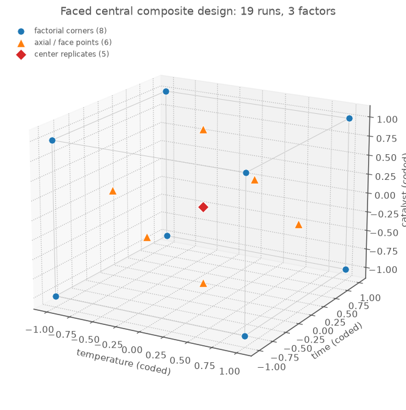
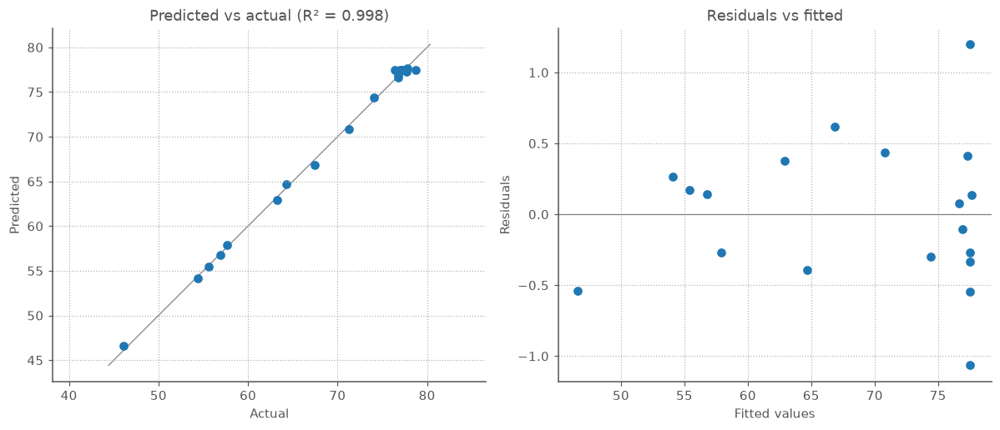
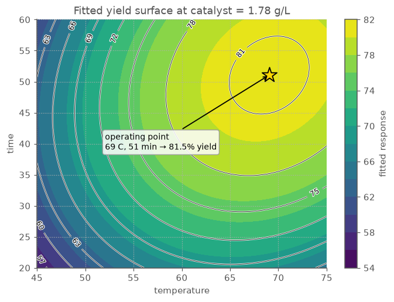

# End-to-end workflow: from factors to an operating point

Most optimization studies follow the same loop. This walkthrough makes one complete pass
through it, one section per step:

1. pin down the factors and the ranges you are willing to run,
2. pick a design that can see curvature — not just slopes — and randomize the run order,
3. run the experiment and record the response against each run,
4. fit a model to the results,
5. decide whether the model can be trusted,
6. read the best setting off the fitted surface,
7. confirm it with a fresh run.

The example is a small reaction-optimization study with three factors you can dial in —
temperature, reaction time, and catalyst loading — and one response to maximize: percent
yield. The same pattern applies to assay development, formulation, process screening, and
any other experiment with continuous inputs.

> Every console output and figure below is real: it is produced by running the snippets
> via `scripts/build_workflow_assets.py`, which writes the figures to `docs/img/`. The
> response is a synthetic-but-realistic quadratic surface so the walkthrough is fully
> reproducible; replace it with your own measurements and the same calls apply.

## 1. Define the experimental space

Every study starts with the knobs you can turn and how far you are willing to turn them.
Choose ranges that are safe and physically sensible, but wide enough that the response
actually moves across them: too narrow and the effect hides in the measurement noise; too
wide and some runs may fail outright or leave the region you care about.

```python
from doe import ContinuousFactor

factors = [
    ContinuousFactor("temperature", low=45, high=75, units="C"),
    ContinuousFactor("time", low=20, high=60, units="min"),
    ContinuousFactor("catalyst", low=0.5, high=2.5, units="g/L"),
]
```

You enter and read everything in natural units — degrees, minutes, g/L. Behind the scenes
the library rescales each factor to a common −1 to +1 range, so no factor dominates the
analysis just because its numbers happen to be larger. The midpoint of each range codes to
zero, so the center of the space is 60 C, 40 min, and 1.5 g/L.

## 2. Generate and randomize the design

The design you choose follows from the question you are asking. If you only need to know
*which* factors matter, a lean two-level screening design is cheapest. But to find a *best
setting* you have to see curvature — a peak, a plateau, a point of diminishing returns —
and a two-level design can only ever fit straight lines. A central composite design adds
the extra runs that let the model bend, so it can locate an optimum instead of just
pointing uphill.

```python
from doe import central_composite

design = central_composite(factors, alpha="faced", center=5).randomize(seed=20260707)

print(design.n_runs, design.n_center)
print(design.runs.head(8).round(2))
```

```text
19 5
   std_order  temperature  time  catalyst
0         12         60.0  40.0       0.5
1         16         60.0  40.0       1.5
2          1         45.0  20.0       2.5
3          8         45.0  40.0       1.5
4         17         60.0  40.0       1.5
5         14         60.0  40.0       1.5
6          6         75.0  60.0       0.5
7         13         60.0  40.0       2.5
```

The `std_order` column remembers where each run sat in the textbook layout, so you can
always trace a result back; the row order shown is the order to actually run at the bench.
Randomizing matters because anything that drifts over a session — an instrument warming up,
reagents ageing, the operator tiring — would otherwise line up with whichever factor
changes slowest in an unshuffled run order and masquerade as that factor's effect. Shuffling the order breaks that link,
turning a lurking bias into ordinary noise.

The design lays down three kinds of run, all visible in the cube below: eight corner points
that span the extremes of every factor, six axial points on the faces that let the model
see curvature, and a center point repeated five times. Repeating the center gives you a
direct read on your own measurement noise — later, that is what tells you whether a poor
fit is the model missing something real or just run-to-run scatter.



## 3. Add the measured response

Once the runs are done, attach the measured yields back onto the design. Keeping the
numbers with the runs — rather than off in a separate spreadsheet — is the simplest guard
against the most damaging mistake in the whole process: a response value paired with the wrong
run.

```python
import numpy as np

# Replace this block with the response values measured in the lab or plant.
coded = design.coded()
rng = np.random.default_rng(42)
yield_pct = (
    78
    + 7.5 * coded["temperature"]
    + 5.0 * coded["time"]
    + 3.0 * coded["catalyst"]
    - 8.0 * coded["temperature"] ** 2
    - 5.5 * coded["time"] ** 2
    - 4.0 * coded["catalyst"] ** 2
    + 2.5 * coded["temperature"] * coded["time"]
    - 1.5 * coded["time"] * coded["catalyst"]
    + rng.normal(0, 0.8, design.n_runs)
)

measured = design.with_response("yield_pct", yield_pct)
```

In a real study this is just your column of measured yields, entered in the order the runs
were performed. The formula above only stands in for the lab so the walkthrough reproduces
the same numbers every time.

## 4. Fit a quadratic model

Fitting a model turns the scattered run results into a single equation for how yield
responds to the three factors. A central composite design is built for a *quadratic* model,
which captures three things at once: each factor's own effect, how pairs of factors combine,
and the curvature that bends the response toward a peak.

```python
from doe import fit_ols

fit = fit_ols(measured, "yield_pct", model="quadratic")

print(f"R2={fit.r_squared:.3f}")
print(f"adjusted R2={fit.adjusted_r2():.3f}")
print(f"predicted R2={fit.predicted_r2():.3f}")

print(fit.summary().round(2))
```

```text
R2=0.998
adjusted R2=0.995
predicted R2=0.985
                      coefficient  effect  std_error       t     p
term                                                              
Intercept                   77.50   77.50       0.26  293.09  0.00
temperature                  7.39   14.78       0.23   32.36  0.00
time                         5.03   10.05       0.23   22.01  0.00
catalyst                     2.93    5.86       0.23   12.83  0.00
temperature:time             2.53    5.06       0.26    9.91  0.00
temperature:catalyst        -0.22   -0.45       0.26   -0.87  0.41
time:catalyst               -1.26   -2.53       0.26   -4.95  0.00
temperature^2               -7.24  -14.47       0.44  -16.56  0.00
time^2                      -5.61  -11.21       0.44  -12.83  0.00
catalyst^2                  -3.76   -7.53       0.44   -8.61  0.00
```

The `effect` column is the one to read first: it is the change in yield as a factor moves
from the low end of its range to the high end. Temperature's effect of about +14.8 says
that going from 45 C to 75 C lifts yield by roughly 15 percentage points — the biggest
single lever in this study. The three R² values printed above all sit near 1 — the quick
signal that the model fits; the next section makes sure that is real and not wishful.

The Pareto plot sorts the effects by size, so the levers that matter stand out from the
ones that do not. Temperature and its curvature term are largest, time is close behind,
catalyst is a moderate third, and the interactions between factors are small — meaning the
factors mostly act on their own rather than ganging up. The practical read: to move yield,
reach for temperature and time first.


## 5. Check whether the model is usable

A good fit on paper is not the same as a model you can bet a run on. Three quick checks
answer the practical questions behind that trust:

- **Will it predict, or does it only describe?** The adjusted and predicted R² printed
  with the fit above should both stay high. A model can hug the very data it was fit to
  and still miss the next run; predicted R² is the one that guards against that.
- **Does it match the shape of the data?** The lack-of-fit check weighs the model's misses
  against the scatter in your repeated center points. A large p-value means the misses are
  no bigger than your own measurement noise — nothing systematic is being left out.
- **Are the factors tangled together?** When two factors move in step, the model cannot
  tell their effects apart. The VIF numbers flag that; values near 1 mean each factor's
  effect comes through cleanly.

```python
print(fit.anova().round(3))

lof = fit.lack_of_fit()
print(f"lack-of-fit p={lof.p_value:.3f}")

print(fit.vif().round(2))
```

```text
                           SS   df       MS         F      p
temperature           546.317  1.0  546.317  1047.064  0.000
time                  252.662  1.0  252.662   484.249  0.000
catalyst               85.914  1.0   85.914   164.661  0.000
temperature:time       51.250  1.0   51.250    98.224  0.000
temperature:catalyst    0.398  1.0    0.398     0.762  0.405
time:catalyst          12.774  1.0   12.774    24.482  0.001
temperature^2         758.010  1.0  758.010  1452.792  0.000
time^2                153.987  1.0  153.987   295.130  0.000
catalyst^2             38.710  1.0   38.710    74.192  0.000
Residual                4.696  9.0    0.522       NaN    NaN
Total                1904.717 18.0      NaN       NaN    NaN

lack-of-fit p=0.755

temperature             1.00
time                    1.00
catalyst                1.00
temperature:time        1.00
temperature:catalyst    1.00
time:catalyst           1.00
temperature^2           1.73
time^2                  1.73
catalyst^2              1.73
Name: VIF, dtype: float64
```

All three checks pass here. The ANOVA table breaks the fit down further, term by term:
its `p` column shows every term except the temperature:catalyst interaction standing
clearly out of the noise, matching the Pareto plot's ranking. The lack-of-fit p-value of
0.75 says the model's misses are ordinary scatter, not a missing term. And no VIF rises
above 1.73 — a payoff of the design itself, which varied the factors independently, so
their effects never blur into one another.

Two plots make the same point at a glance. On the left, predicted versus actual: when the
model tracks reality, the points fall along the diagonal. On the right, the residuals —
what the model missed on each run — should scatter randomly around zero; a funnel or a
curve would be a warning sign. Both look clean, so the model is safe to act on.



## 6. Choose the operating point

With a model you trust, you can finally ask it the question the experiment was run to
answer: *which settings give the most yield?* Two functions answer it. `stationary_point`
finds the exact top of the fitted surface and reports whether it really is a peak. `optimum`
finds the best setting that stays inside the ranges you actually tested — the answer to
trust, because the model is only anchored by data within that box.

```python
stationary = fit.stationary_point()
optimum = fit.optimum(maximize=True)

print(stationary)
print(optimum)
```

```text
StationaryPoint(maximum: temperature=69.05, time=51.06, catalyst=1.779 -> yield_pct=81.53)
Optimum(max: temperature=69.05, time=51.06, catalyst=1.779 -> yield_pct=81.53)
```

Here the peak lands comfortably inside the tested ranges, so both functions agree: about
69 C, 51 minutes, and 1.8 g/L catalyst, for a predicted 81.5% yield. When the peak instead
falls outside the box, `optimum` stops at the edge of the tested region — it will not
recommend a setting the data cannot vouch for. (The reported response is labelled
`yield_pct` because that is the name of the response column the fit was built from.) You can
also cap the search yourself — e.g. `fit.optimum(maximize=True, bounds={"temperature": (45, 70)})`
restricts the search to a narrower, natural-unit temperature range instead of the full tested box.

The contour map shows where that setting sits. Sliced at the best catalyst loading, yield
climbs from the low-temperature, short-time corner to a clear interior peak, marked with
a star. Because
the optimum is a hilltop rather than a hard corner, it sits on a gentle plateau — small
day-to-day drift in the setup costs only a little yield, which is exactly the robustness you
want in an operating point.



## 7. Plan the confirmation run

The optimum is still only a prediction. Before you rely on it — or report it — run the
experiment at that setting and check the yield against what the model promised:

```python
confirmation = optimum.to_frame().round(2)
print(confirmation)
print(round(fit.predict(optimum.natural), 2))
```

```text
   temperature   time  catalyst  yield_pct
0        69.05  51.06      1.78      81.53
81.53
```

Run the confirmation point once or twice. If the measured yield lands near the predicted
81.5%, within the run-to-run scatter you already saw across the design, the study has
delivered an operating point you can stand behind. If it comes in well short, the model has
been pushed past where it holds: add a handful of runs around this region, refit, and
re-confirm before committing to the setting.

