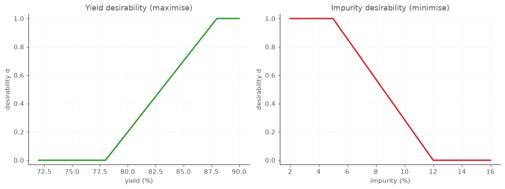

# End-to-end workflow: balancing two competing readouts

The [first walkthrough](WORKFLOW.md) chased a single number to its peak. Real studies are
rarely that tidy. You want high yield *and* low impurity, a bright signal *and* low background,
a strong material *and* a cheap one — and the setting that maximizes one almost always degrades
the other. When two readouts pull in opposite directions, "the optimum" stops being a hilltop
and becomes a *compromise*. That compromise deserves to be chosen deliberately, in the units
you actually control — not left to emerge from squinting at two contour plots side by side.

This walkthrough makes one complete pass through that choice, one section per step:

1. design the experiment exactly as you would for a single readout,
2. record two readouts on every run instead of one,
3. fit a separate model to each readout,
4. see the conflict — each readout's own best setting ruins the other,
5. put both readouts on one common 0-to-1 scale of *desirability*,
6. let the optimizer find the setting that balances them,
7. read the trade-off it struck, tune it, and confirm.

The running example is a small reaction study with two factors — temperature and reaction
time — and two readouts that fight: **percent yield**, which you want high, and **percent
impurity**, which you want low. Pushing the reaction harder (hotter, longer) makes more product
but also more junk, so "maximize yield" by itself is the wrong question. The same pattern
covers assay development (signal vs. background), formulation (potency vs. stability), and any
study where two measured outcomes disagree about what "better" means.

> Every console output and figure below is real: it is produced by running these snippets via
> `scripts/build_workflow2_assets.py`, which writes the figures to `docs/img/`. The two
> readouts are simulated from realistic quadratic surfaces so the walkthrough is fully
> reproducible; swap in your own measurements and the same calls apply.

## 1. Design the experiment

Nothing about having two readouts changes the design. You choose factors and ranges, generate a
response-surface design, and run it once — measuring two things on every run instead of one.

The design here is a central composite: the four corners of the temperature–time box, four
*axial* points at the midpoints of its sides, and a center point replicated five times. The
corners and axial points give the model three levels of each factor, which is what lets it see
*curvature* — essential, because a best setting in the middle of the region only shows up as
the top of a curve. The replicated center runs measure run-to-run noise: five runs at identical
settings never give identical numbers, and their scatter tells you what "close to prediction"
should mean when you confirm the result at the end. (The [first walkthrough](WORKFLOW.md)
covers these design choices in more depth.) Two factors keep every picture in this walkthrough
on one readable map, including the final desirability surface.

```python
from doe import ContinuousFactor, central_composite

factors = [
    ContinuousFactor("temperature", low=60, high=100, units="C"),
    ContinuousFactor("time", low=30, high=90, units="min"),
]

design = central_composite(factors, alpha="faced", center=5).randomize(seed=20260708)

print(design.n_runs, design.n_center)
print(design.runs.head(8).round(2))
```

```text
13 5
   std_order  temperature  time
0          3        100.0  90.0
1          0         60.0  30.0
2          5        100.0  60.0
3         11         80.0  60.0
4         12         80.0  60.0
5          7         80.0  90.0
6          2        100.0  30.0
7          4         60.0  60.0
```

Thirteen runs, five of them center replicates, in randomized order. This is the entire
experimental cost of the study — the second readout adds columns to your notebook, not runs to
your bench.

## 2. Record both readouts

After the runs, attach both measured columns to the design — the library calls each one a
*response*. Keeping both readouts attached to the same runs, rather than in separate
spreadsheets, guarantees that the two models you are about to fit describe exactly the same
experiment.

The block below stands in for your lab notebook: it simulates plausible yield and impurity
measurements so that every number downstream is reproducible. In a real study you would replace
it with the two columns you measured.

```python
import numpy as np

# Replace this block with the two response columns measured in the lab.
coded = design.coded()
t, m = coded["temperature"], coded["time"]
rng = np.random.default_rng(2026)

yield_pct = (
    82.0 + 6.0 * t + 4.5 * m
    - 4.0 * t**2 - 3.0 * m**2 + 1.5 * t * m
    + rng.normal(0, 0.7, design.n_runs)
)
impurity_pct = (
    8.0 + 3.5 * t + 2.5 * m
    + 0.8 * t**2 + 0.5 * m**2
    + rng.normal(0, 0.4, design.n_runs)
)

measured = design.with_responses(yield_pct=yield_pct, impurity_pct=impurity_pct)
print(measured.runs.head(8).round(2))
```

```text
   std_order  temperature  time  yield_pct  impurity_pct
0          3        100.0  90.0      86.44         15.27
1          0         60.0  30.0      66.17          3.36
2          5        100.0  60.0      82.67         12.05
3         11         80.0  60.0      82.98          7.84
4         12         80.0  60.0      82.45          8.22
5          7         80.0  90.0      83.30         10.95
6          2        100.0  30.0      74.78          9.75
7          4         60.0  60.0      72.21          5.11
```

Two rows already contain the whole problem. The hottest, longest run (100 C, 90 min) gives the
best yield of the batch, 86.4% — and the worst impurity, 15.3%. The coolest, shortest run
(60 C, 30 min) is the cleanest at 3.4% impurity — and the worst yield, 66.2%. The two readouts
rank the runs in nearly opposite orders, and no amount of staring at the table will tell you
where between those extremes to operate. That takes the next four steps.

## 3. Fit one model per readout

Each readout gets its own model, fitted exactly as in a single-readout study. There is no
clever joint fit: yield becomes one surface over temperature and time, impurity becomes a
separate surface over the same two factors, and the trade-off between them waits until step
5 — where you control it — rather than being buried inside the statistics.

```python
from doe import fit_ols

fit_yield = fit_ols(measured, "yield_pct", model="quadratic")
fit_imp = fit_ols(measured, "impurity_pct", model="quadratic")

for name, fit in (("yield_pct", fit_yield), ("impurity_pct", fit_imp)):
    print(f"\n{name}: R2={fit.r_squared:.3f}  adjR2={fit.adjusted_r2():.3f}  "
          f"predR2={fit.predicted_r2():.3f}")
    print(fit.summary().round(2))
```

```text
yield_pct: R2=0.996  adjR2=0.994  predR2=0.982
                  coefficient  effect  std_error       t    p
term                                                         
Intercept               82.25   82.25       0.20  414.37  0.0
temperature              5.61   11.23       0.20   28.76  0.0
time                     4.30    8.59       0.20   22.01  0.0
temperature:time         1.50    2.99       0.24    6.26  0.0
temperature^2           -4.59   -9.19       0.29  -15.97  0.0
time^2                  -2.96   -5.92       0.29  -10.28  0.0

impurity_pct: R2=0.995  adjR2=0.991  predR2=0.984
                  coefficient  effect  std_error      t     p
term                                                         
Intercept                8.18    8.18       0.12  67.43  0.00
temperature              3.40    6.80       0.12  28.51  0.00
time                     2.51    5.02       0.12  21.04  0.00
temperature:time         0.17    0.34       0.15   1.15  0.29
temperature^2            0.46    0.92       0.18   2.63  0.03
time^2                   0.48    0.96       0.18   2.74  0.03
```

First, can you trust them? All three R² values are near 1 for both models — each surface
explains nearly all the variation in its readout, and predicts runs it has not seen almost as
well — so both are safe to act on. (The [first walkthrough](WORKFLOW.md) covers the fuller
trust checks — lack-of-fit, residual plots — and they apply to each readout unchanged.)

Then read the two `effect` columns side by side; an *effect* is the predicted change in a
readout as one factor swings from its low setting to its high one. The conflict is already
visible in the signs. For **yield**, temperature and time both help, but the two negative
squared terms mean the surface *domes*: it rises, flattens, and bends back down, so there is a
genuine peak inside the region. For **impurity**, every term is positive and the squared terms
are small: the surface simply *climbs* as either factor increases, so the cleanest product sits
at the coolest, shortest corner. One readout peaks in the interior; the other bottoms out at a
corner. Those two places are not the same place.

## 4. See the conflict

Before combining anything, make the disagreement explicit: find each readout's *own* best
setting, then ask what the *other* readout does there. Each fit's `.optimum()` method performs
the search over the tested region — maximizing for yield, minimizing for impurity.

```python
opt_yield = fit_yield.optimum(maximize=True)
opt_imp = fit_imp.optimum(maximize=False)
print(opt_yield)
print(opt_imp)

# Cross-read: predict each readout at the *other's* optimum.
print(f"impurity at the yield-only optimum: {fit_imp.predict(opt_yield.natural):.1f}%")
print(f"yield at the impurity-only optimum: {fit_yield.predict(opt_imp.natural):.1f}%")
```

```text
Optimum(max: temperature=95.21, time=87.56 -> yield_pct=86.36)
Optimum(min: temperature=60, time=30 -> impurity_pct=3.381 (at bound))
impurity at the yield-only optimum: 13.9%
yield at the impurity-only optimum: 66.3%
```

That is the trade-off, quantified. Chase **yield alone** and you land at 95 C, 88 min with
86.4% yield — and 13.9% impurity. Chase **purity alone** and you retreat to the cold corner —
60 C, 30 min, flagged `at bound` because impurity has no interior minimum, only an edge of the
tested region — for a clean 3.4%, while yield collapses to 66%. Neither is a setting you would
actually run: one makes too much junk, the other too little product.

The two fitted surfaces show why no single setting can win. Yield peaks toward the hot, long
corner; impurity is lowest in the cool, short corner. The best of one map is the worst of the
other.


## 5. Put both readouts on one ruler

Yield and impurity both happen to be percentages here, yet they still cannot be compared
directly — a point of yield is not worth a point of impurity, and in general two readouts will
not even share units. **Desirability** fixes this by translating each readout onto the same
unitless 0-to-1 scale, where 0 means unacceptable and 1 means ideal. You write the translation
as a `ResponseGoal` per readout: a direction (`"max"`, `"min"`, or `"target"`) plus the range
over which the score ramps from unacceptable to ideal.

```python
from doe import ResponseGoal

goals = [
    ResponseGoal(fit_yield, goal="max", low=78.0, high=88.0),   # yield: 0 below 78, 1 at 88
    ResponseGoal(fit_imp,   goal="min", low=5.0,  high=12.0),   # impurity: 1 below 5, 0 at 12
]
```

Those four numbers are where your judgment enters the analysis — take them from spec limits,
from what the next step in your process can tolerate, from the range you saw across your own
runs — and choose them on purpose, because they *are* the definition of "good" that everything
downstream optimizes. For **yield**, `low=78, high=88` says: below 78% the batch is no use to
me, 88% is as good as I need, and anything between earns proportional credit. The `"min"` goal
flips the ramp for **impurity**: at or below 5% is ideal, at or above 12% is a reject. That 12%
cutoff is a decision with teeth — the yield-only optimum ran at 13.9% impurity, which this goal
now scores as flatly *unacceptable*.



## 6. Find the balanced operating point

With both readouts on the same ruler, `desirability` can search for the setting that scores
well on *both* at once. It combines the two individual scores into one overall score `D` by
taking their **geometric mean** — multiply them together and take the square root,
`D = (d₁ × d₂)^(1/2)` — and finds the setting that maximizes `D` over the tested region.

```python
from doe import desirability

des = desirability(goals)
print(des)
print("responses  =", des.responses.round(1))
print("individual =", des.individual.round(3))
print("overall D  =", round(des.overall, 3))
```

```text
DesirabilityResult(D=0.4892: temperature=81.32, time=62.72 | yield_pct=82.98, impurity_pct=8.635)
responses  = yield_pct       83.0
impurity_pct     8.6
dtype: float64
individual = yield_pct       0.498
impurity_pct    0.481
dtype: float64
overall D  = 0.489
```

The balance lands at **81 C, 63 min**: a predicted **83.0% yield at 8.6% impurity**. Set that
against the two single-readout answers from step 4. Compared with chasing yield alone, it gives
back about 3 points of yield (86.4 → 83.0) to pull impurity down from an unacceptable 13.9% to
a comfortable 8.6%. Compared with chasing purity alone, it buys back 17 points of yield
(66 → 83) for about five points of impurity (3.4 → 8.6). Neither extreme is a setting you would
actually run; this one is.

Why a geometric mean rather than a plain average? Because the scores *multiply*, a single zero
drags the whole product to zero: a setting that nails yield but busts the 12% impurity cutoff
scores `D = 0`, no matter how spectacular the yield. It is a veto, not an average — every
readout must stay at least acceptable. The same multiplication explains why the two individual
scores come out nearly equal here (0.498 and 0.481): a product is largest when neither factor
is sacrificed to prop up the other.

The desirability map folds both readouts into one surface, and its bright plateau is the region
where yield and impurity are *both* good.


The three markers retell the whole story on one map. The **gold star** — the balance — sits
squarely on the bright plateau. The **red X** (yield-only) has slid off into a dark band: the
extra heat that maximized yield pushed impurity past its cutoff and collapsed `D`. The **magenta
triangle** (impurity-only) is off the plateau in the other direction, where the reaction is too
gentle to make enough product. Optimizing either readout alone walks you off the plateau;
desirability walks you onto it.

## 7. Tune the trade-off, then confirm

The balance is only as good as the goals that defined it, and re-striking it costs nothing but
an edit — the models are already fitted, so no new runs are needed. Suppose your process really
cannot tolerate more than 9% impurity, and merely acceptable is not enough — you want the
optimizer to push hard toward clean. Tighten impurity's `high` to 9, and add `weight=2`, which
bows the ramp so impurity earns little credit until it gets close to the 5% ideal.

```python
strict = [
    ResponseGoal(fit_yield, goal="max", low=78.0, high=88.0),
    ResponseGoal(fit_imp,   goal="min", low=5.0,  high=9.0, weight=2.0),
]
des_strict = desirability(strict)
print("natural   =", {k: round(v, 1) for k, v in des_strict.natural.items()})
print("responses =", des_strict.responses.round(1))
print("overall D =", round(des_strict.overall, 3))
```

```text
natural   = {'temperature': 76.1, 'time': 54.4}
responses = yield_pct       80.1
impurity_pct     7.1
dtype: float64
overall D = 0.221
```

The stricter demand moves the balance to a cooler, shorter setting — 76 C, 54 min — where yield
eases to 80.1% to buy impurity down to 7.1%. Note that the overall `D` fell to 0.22. That does
not mean the new setting is worse; it means you raised the bar. `D` is always measured against
the goals you declared, so only compare `D` values between settings judged by the *same* goals.
Any goal can be re-struck the same way: nudge a `low` or `high`, change a `weight`, or switch a
goal to `"target"` (with a `target=` value) for a readout you want *at* a set point rather than
merely high or low.


Redrawing the map under the new goals shows why the star moved rather than just where. The
plateau itself has shrunk and slid toward the cool, short corner — the stricter 9% impurity
cutoff disqualifies everywhere the old 12% cutoff tolerated. The original balance (gold star)
is now stranded off the shrunken plateau; the new stricter balance (orange star) sits on it.
Tuning a goal does not just rescore the old optimum, it reshapes the region the optimizer is
allowed to consider.

Whichever goals you settle on, the recommended setting is still a prediction from two models.
Before committing to it, go back to the bench:

```python
print(des.to_frame().round(1))
print(f"predicted yield    = {fit_yield.predict(des.natural):.1f}%")
print(f"predicted impurity = {fit_imp.predict(des.natural):.1f}%")
print(fit_yield.predict(des.natural, interval="prediction").round(1))
print(fit_imp.predict(des.natural, interval="prediction").round(1))
```

```text
   temperature  time  yield_pct  impurity_pct  overall_D
0        81.3  62.7       83.0           8.6        0.5
predicted yield    = 83.0%
predicted impurity = 8.6%
    fit   se  lower  upper
0  83.0  0.5   81.8   84.2
   fit   se  lower  upper
0  8.6  0.3    7.9    9.4
```

With two readouts there are two confirmation targets, and each deserves a *range* rather than
a single number — a fresh run will not reproduce 83.0% and 8.6% exactly. `predict(...,
interval="prediction")` gives each one: a 95% **prediction interval** of about 81.8–84.2% for
yield and 7.9–9.4% for impurity — the bands a single confirmation run should fall inside. Each
folds in that readout's own run-to-run scatter (the impurity band is tighter because impurity
was the quieter measurement), so the two are exactly the yardsticks to judge the confirmation
run against — one per readout.

Run the balance point once or twice and check *both* readouts against their intervals. If the
measured yield and impurity land inside 81.8–84.2% and 7.9–9.4%, the study has delivered an
operating point that honors both goals, and you can stand behind it. If either readout lands
outside its band, that model has been pushed past where it holds: add a few runs around this
region, refit that readout, and re-strike the balance before committing.

**Takeaway.** With more than one readout, do not optimize them one at a time and hope. Give
each readout its own model, state each goal as a 0-to-1 desirability ramp, let the geometric
mean find the setting that keeps every readout acceptable, and read — and tune — the trade-off
it struck, explicitly, in the units you set on the bench.
