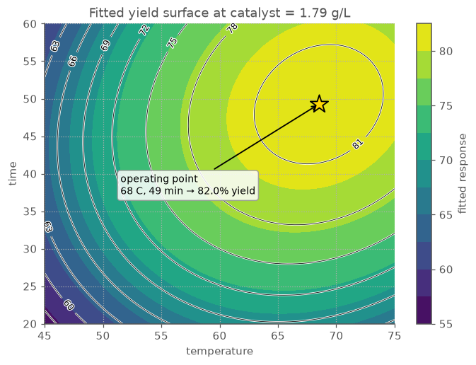

# End-to-end workflow: screening six factors before optimizing three

The [first walkthrough](WORKFLOW.md) began with three factors "you can dial in" — as if
someone had already told you which three. Real studies rarely start that generously. At the
bench you face a longer list of *maybes*: knobs that could plausibly matter, each with an
advocate, none with proof. Mapping a full curved response surface over every suspect is
unaffordable — and most of those runs would be spent lavishly characterizing factors that turn
out to do nothing.

This walkthrough is the missing first act: how you get from "six knobs, no idea" to "three
factors worth optimizing" — and how the runs you spend finding out are *not* thrown away, but
recycled into the optimization itself. One complete pass, one section per step:

1. face the real starting point: six candidate factors and a run budget that cannot map them all,
2. run a 16-run screen that varies all six at once,
3. read the effects, and let the half-normal plot separate the real factors from the noise,
4. keep the vital few and park the rest,
5. recycle the 16 screening runs, letting the library choose the handful of extra runs a
   curved model still needs,
6. measure only the new runs and fit the quadratic,
7. read off the operating point — and tally what the campaign cost.

The example is the same reaction study as the first walkthrough — but rewound to before that
study "started". Alongside temperature, reaction time, and catalyst loading, three more knobs
are on the suspect list: pH, stir rate, and co-solvent fraction. Percent yield is still the
response. By the end, the campaign arrives at the same operating point the first walkthrough
found — having started with twice as many factors and no idea which ones counted.

> Every console output and figure below is real: it is produced by running these snippets via
> `scripts/build_workflow3_assets.py`, which writes the figures to `docs/img/`. The response
> is simulated from the same realistic surface as the first walkthrough — three factors that
> genuinely act, three that barely whisper — so the walkthrough is fully reproducible; replace
> it with your own measurements and the same calls apply.

## 1. Six suspects, one run budget

Write down every factor that could plausibly move the response, with honest ranges — exactly
as in the first walkthrough, just more of them:

```python
from doe import ContinuousFactor, central_composite

factors = [
    ContinuousFactor("temperature", low=45, high=75, units="C"),
    ContinuousFactor("time", low=20, high=60, units="min"),
    ContinuousFactor("catalyst", low=0.5, high=2.5, units="g/L"),
    ContinuousFactor("pH", low=6.0, high=8.0),
    ContinuousFactor("stir_rate", low=300, high=900, units="rpm"),
    ContinuousFactor("solvent", low=10, high=30, units="%"),
]
```

Now ask what it would cost to do what the first walkthrough did — a curvature-mapping central
composite design — on all six at once:

```python
one_shot = central_composite(factors, alpha="faced", center=5)
print(one_shot.n_runs)
```

```text
81
```

Eighty-one runs. The curved model behind a response surface needs a coefficient for every
factor, every pair of factors, and every factor's curvature — 28 numbers for six factors — and
the design must buy information for each of them. Worse, if only some factors matter, most of
that budget is spent mapping the curvature of knobs that do nothing.

Decades of screening experiments point the other way: in most studies, *most factors don't
matter much*. A handful drive the response; the rest wiggle it by less than the run-to-run
noise. That regularity — the "vital few and trivial many" — is what a two-stage strategy
exploits: first a cheap screen whose only job is to sort the six suspects into those two
piles, then a focused study that spends the real budget on the survivors.

## 2. A screen that varies everything at once

Bench intuition says: to test six factors, change one at a time and hold the rest fixed. That
costs more runs than it sounds and tells you less — each run only informs the one factor you
moved. A *fractional factorial* does the opposite: every run moves **all six factors at once**,
following a pattern balanced so precisely that each factor's effect can still be read out
cleanly at the end.

```python
from doe import fractional_factorial

screen = fractional_factorial(
    factors, generators=["E=ABC", "F=BCD"]
).randomize(seed=20260709)

print(screen.n_runs)
print(screen.runs.head(8).round(2))
```

```text
16
   std_order  temperature  time  catalyst   pH  stir_rate  solvent
0         10         75.0  20.0       2.5  6.0      300.0     30.0
1          1         45.0  20.0       0.5  8.0      300.0     30.0
2          0         45.0  20.0       0.5  6.0      300.0     10.0
3          8         75.0  20.0       0.5  6.0      900.0     10.0
4          7         45.0  60.0       2.5  8.0      300.0     30.0
5         14         75.0  60.0       2.5  6.0      900.0     10.0
6          2         45.0  20.0       2.5  6.0      900.0     30.0
7          4         45.0  60.0       0.5  6.0      900.0     30.0
```

Sixteen runs for six factors, each factor tested only at its low and high setting. The
`generators` argument is the recipe for the discount: sixteen runs is the full high/low recipe
for *four* factors, and the last two factors ride along on patterns built from products of the
first four (`E=ABC` sets stir_rate's highs and lows by multiplying the temperature, time, and
catalyst columns; `F=BCD` does the same for solvent). The price of the discount is called
*aliasing*: certain factor *combinations* end up sharing a pattern, so their effects cannot be
told apart. This particular recipe (a "resolution IV" design, in the jargon) pays that price
only among pairs — every *single* factor's effect stays clean, which is exactly what a screen
is for. Judging pairs and curvature is deliberately deferred to stage two.


The tile map shows the balance at a glance. Every column is half high, half low, so each
factor gets a fair hearing; and any two columns pair each setting of one factor with both
settings of the other equally often, so no factor's effect can masquerade as another's. This
is what sixteen runs shared six ways looks like when nothing is wasted.

## 3. Run the screen and read the effects

Run the sixteen (in the randomized order shown) and attach the measured yields. The block
below stands in for the lab: it simulates yields from a realistic surface in which — as is
about to become very visible — only three of the six knobs genuinely act.

```python
import numpy as np
import pandas as pd


def bench_yield(coded_runs: pd.DataFrame, rng: np.random.Generator) -> np.ndarray:
    """Stand-in for the lab bench: the 'true' yield surface plus run-to-run noise.

    Only three of the six knobs actually do anything; pH, stir_rate, and solvent
    contribute a whisper (folded into the noise once they are dropped and held fixed).
    Replace this with your own measurements.
    """
    t, m, c = coded_runs["temperature"], coded_runs["time"], coded_runs["catalyst"]
    y = (
        78
        + 7.5 * t + 5.0 * m + 3.0 * c
        - 8.0 * t**2 - 5.5 * m**2 - 4.0 * c**2
        + 2.5 * t * m - 1.5 * m * c
    )
    for name, beta in (("pH", 0.4), ("stir_rate", -0.3), ("solvent", 0.35)):
        if name in coded_runs:
            y = y + beta * coded_runs[name]
    return np.asarray(y + rng.normal(0, 0.8, len(coded_runs)))


rng = np.random.default_rng(20260709)
measured = screen.with_response("yield_pct", bench_yield(screen.coded(), rng))
print(measured.runs.head(8).round(2))
```

```text
   std_order  temperature  time  catalyst   pH  stir_rate  solvent  yield_pct
0         10         75.0  20.0       2.5  6.0      300.0     30.0      65.73
1          1         45.0  20.0       0.5  8.0      300.0     30.0      48.12
2          0         45.0  20.0       0.5  6.0      300.0     10.0      45.71
3          8         75.0  20.0       0.5  6.0      900.0     10.0      54.26
4          7         45.0  60.0       2.5  8.0      300.0     30.0      58.46
5         14         75.0  60.0       2.5  6.0      900.0     10.0      74.92
6          2         45.0  20.0       2.5  6.0      900.0     30.0      54.20
7          4         45.0  60.0       0.5  6.0      900.0     30.0      55.13
```

A screen's model is deliberately simple — one straight-line effect per factor, nothing else:

```python
from doe import fit_ols

screen_fit = fit_ols(measured, "yield_pct", interactions=False)
print(f"R2={screen_fit.r_squared:.3f}")
print(screen_fit.summary().round(2))
```

```text
R2=0.908
             coefficient  effect  std_error      t     p
term                                                    
Intercept          60.80   60.80       0.99  61.34  0.00
temperature         7.21   14.41       0.99   7.27  0.00
time                5.11   10.22       0.99   5.16  0.00
catalyst            2.94    5.89       0.99   2.97  0.02
pH                  0.62    1.25       0.99   0.63  0.55
stir_rate          -0.46   -0.92       0.99  -0.47  0.65
solvent             0.47    0.94       0.99   0.47  0.65
```

Read the `effect` column: the change in yield as each factor swings from its low setting to
its high one. The verdict splits the table in two. Temperature moves yield by about 14 points,
time by 10, catalyst by 6. Then a cliff: pH, stir rate, and solvent each move it by about one
point — the same size as the run-to-run noise, and their p-values (0.55–0.65) say as much.
(The error bars here are honest but generous: any effect of factor *pairs* is deliberately not
modelled by a screen, so it gets counted as noise.)

The half-normal plot delivers the same verdict as a picture — and it is the picture screening
was invented for. The idea: if a factor did nothing, its measured "effect" is just noise, and
noise effects line up along a straight line rising from the origin. Factors that genuinely act
break away above that line.


Three points hug the noise line in the corner; three break decisively above it. You do not
need a p-value to see which factors are real — the eye does the statistics.


The Pareto and main-effects plots retell it two more ways: three tall bars and a cliff; three
steep slopes and three flat lines. Sixteen runs, six suspects, verdict delivered.

## 4. Keep the vital few, park the rest

The decision this stage exists for: **temperature, time, and catalyst go forward; pH, stir
rate, and solvent are parked.** Parking a factor means setting it to whatever value is
cheapest or most convenient — and *writing that value down in the batch record*, because from
here on it must stay fixed. Its (tiny) influence folds quietly into the run-to-run noise.

Note what the screen deliberately did *not* tell you. Every run sat at a corner of the
six-factor space, and corner-only data can only measure straight-line slopes — the screen is
blind to curvature, so it can rank the factors but cannot find a peak. (You can see the
blindness in the numbers: the screen's intercept, 60.8, is the average yield *at the edges* of
the space — it has no idea the middle is higher.) Finding the peak is stage two's job, and it
needs runs at mid-level settings the screen never visited.

## 5. Recycle the screen into a curvature design

Here is the part most campaigns waste: the sixteen screening runs are not spent. Because the
three parked factors turned out inert, those sixteen runs are still sixteen honest
measurements of the three survivors — you already own them. Project the screen onto the
surviving factors and look at where its runs landed in *their* space:

```python
keep = ["temperature", "time", "catalyst"]
projected = measured.project(keep)

print(projected.coded().value_counts().sort_index())
```

`Design.project` narrows the design to the named factors, dropping the columns of the three
parked ones while every run — and its measured yield — stays put. The dropped factors simply
collapse, so runs that differed only in `pH`, `stir_rate`, or `solvent` now coincide:

```text
temperature  time  catalyst
-1.0         -1.0  -1.0        2
                    1.0        2
              1.0  -1.0        2
                    1.0        2
 1.0         -1.0  -1.0        2
                    1.0        2
              1.0  -1.0        2
                    1.0        2
Name: count, dtype: int64
```

A tidy surprise: the sixteen runs land exactly on the eight corners of the survivors' cube,
each corner measured **twice**. (Not luck — the screen's balance guarantees that its runs
project evenly onto any few factors you keep.) That is a solid foundation for a curved model —
but corners alone cannot support one. Ask directly:

```python
from doe import augment, efficiency

eff_before = efficiency(projected, order=2)
print(f"D-efficiency for a quadratic model, screen runs only: {eff_before.d:.3f}")

augmented = augment(projected, n_runs=8, model="quadratic", seed=20260710)
eff_after = efficiency(augmented, order=2)
print(f"D-efficiency for a quadratic model, after augmenting:  {eff_after.d:.3f}")
```

```text
D-efficiency for a quadratic model, screen runs only: 0.000
D-efficiency for a quadratic model, after augmenting:  0.465
```

The efficiency score asks "how well can this set of runs support the model?", and for the
corner-only projection the answer is exactly zero — not *poor* but *impossible*: runs at two
levels can never tell a straight slope from a curve. `augment` fixes precisely that. It takes
the sixteen runs as given, works out what information a quadratic model still lacks, and
searches for the eight new runs that add the most of it. After augmenting, the score is a
healthy 0.465 (a score of 1 being an ideal reference design). For calibration: the first
walkthrough's textbook 19-run central composite design scores 0.381 on the same model — the
recycled design is not just cheaper, it is slightly the stronger of the two.

```python
new_runs = augmented.runs.assign(point_type=augmented.point_types).tail(8)
print(f"{augmented.n_runs} runs total; the 8 new runs to go measure:")
print(new_runs.round(2))
```

```text
24 runs total; the 8 new runs to go measure:
    temperature  time  catalyst point_type
16         60.0  60.0       1.5    augment
17         45.0  40.0       1.5    augment
18         60.0  20.0       2.5    augment
19         75.0  20.0       1.5    augment
20         60.0  20.0       1.5    augment
21         60.0  40.0       2.5    augment
22         60.0  40.0       0.5    augment
23         75.0  40.0       1.5    augment
```

Look at what the search chose: every new run uses mid-level settings (60 C, 40 min, 1.5 g/L)
in one or more factors — the three-level information that curvature needs and the corners
lack. These play the same role as the axial points of the first walkthrough's central
composite design, except no one had to know that recipe: the engine derived where the gaps
were from the runs already in hand.


The cube tells the campaign's story in one picture: the corners you already paid for in the
screen (blue), and the eight new mid-level runs (orange) that let the model bend. At the bench,
run the eight in random order, with the three parked factors held at their recorded settings.

## 6. Measure only the new runs and fit the quadratic

Eight new measurements — that is the entire experimental cost of this stage. Combine them with
the sixteen yields already in the notebook, attach the lot to the augmented design, and fit
exactly as in the first walkthrough:

```python
yield_new = bench_yield(augmented.coded().iloc[projected.n_runs :], rng)
all_yields = np.concatenate([measured.runs["yield_pct"].to_numpy(), yield_new])
measured2 = augmented.with_response("yield_pct", all_yields)

fit = fit_ols(measured2, "yield_pct", model="quadratic")
print(f"R2={fit.r_squared:.3f}")
print(f"adjusted R2={fit.adjusted_r2():.3f}")
print(f"predicted R2={fit.predicted_r2():.3f}")
print(fit.summary().round(2))
```

```text
R2=0.992
adjusted R2=0.987
predicted R2=0.978
                      coefficient  effect  std_error       t     p
term                                                              
Intercept                   78.35   78.35       0.69  114.01  0.00
temperature                  7.17   14.35       0.26   27.61  0.00
time                         5.03   10.07       0.25   19.77  0.00
catalyst                     2.90    5.79       0.26   11.15  0.00
temperature:time             2.37    4.74       0.27    8.62  0.00
temperature:catalyst         0.28    0.57       0.28    1.01  0.33
time:catalyst               -1.70   -3.39       0.27   -6.17  0.00
temperature^2               -7.37  -14.75       0.61  -12.04  0.00
time^2                      -6.34  -12.69       0.68   -9.36  0.00
catalyst^2                  -3.86   -7.72       0.61   -6.30  0.00
```

The model now sees everything the screen could not. The main effects confirm the screen's
ranking almost digit for digit (temperature 14.4 there, 14.35 here). New are the interaction
terms — temperature and time reinforce each other, time and catalyst work slightly against
each other — and, above all, the three negative squared terms: the dome. Yield rises, rolls
over, and comes back down in every factor, which is exactly the shape that hides a best
setting in the interior. And note the intercept: 78.4, up from the screen's 60.8 — the middle
of the space really was higher than the corners, and now the model knows it.

One honest cost of recycling: the sixteen reused runs were performed while the parked factors
were still moving, so their little wiggles ride along as extra noise in this fit — a slightly
blurrier picture, never a biased one. All three R² values stay high regardless, and the
predicted R² of 0.978 says the model predicts runs it has never seen.


The diagnostic pair looks clean: predictions hug the diagonal, and what the model missed is
structureless scatter. (One check from the first walkthrough is unavailable here: the
lack-of-fit test needs repeated center runs, and this campaign has none. If you want it, spend
two extra runs repeating the center point — the budget below still comes out far ahead.)

## 7. The operating point — and the bill

With a trusted curved model, ask it the question the whole campaign was for:

```python
optimum = fit.optimum(maximize=True)
print(optimum)
print(optimum.to_frame().round(2))
print(fit.predict(optimum.natural, interval="prediction").round(2))
```

```text
Optimum(max: temperature=68.5, time=49.26, catalyst=1.794 -> yield_pct=81.97)
   temperature   time  catalyst  yield_pct
0         68.5  49.26      1.79      81.97
     fit    se  lower  upper
0  81.97  1.27  79.25   84.7
```

About 68 C, 49 minutes, 1.8 g/L catalyst, for a predicted 82% yield — or, honestly, a 95%
**prediction interval** of about 79.3% to 84.7%, the band a confirmation run should land
inside. Note it is wider than the first walkthrough's 79.8–83.3%: this campaign carries the
extra scatter from recycling runs measured while the parked factors still moved (the `se` of
1.27 against the first walkthrough's 0.79), and the prediction interval makes that honesty
visible. Usefully, this band is available even though the lack-of-fit test was not — a
prediction interval needs only the fitted model's residual scatter, not repeated center runs. Set that against the
first walkthrough, which *started* from the three right factors and concluded 69 C, 51 min,
1.8 g/L for 81.5%: the same operating point, to within the noise. This campaign earned it the
hard way — starting from six suspects and no idea which mattered — and still got there.



Now the bill. Three ways this campaign could have been run:

```python
fresh_ccd = central_composite(list(survivors), alpha="faced", center=5).n_runs
total_fresh = screen.n_runs + fresh_ccd
print(f"one-shot on six factors:        {one_shot.n_runs} runs")
print(f"screen + fresh CCD on three:    {screen.n_runs} + {fresh_ccd} = {total_fresh} runs")
print(f"screen + augment (this route):  {screen.n_runs} + 8 = {augmented.n_runs} runs")
```

```text
one-shot on six factors:        81 runs
screen + fresh CCD on three:    16 + 19 = 35 runs
screen + augment (this route):  16 + 8 = 24 runs
```


The one-shot design costs 81 runs, most of them spent mapping the curvature of three factors
that do nothing. Screening first and then starting a fresh response-surface design on the
survivors is far better at 35 — but it treats the sixteen screening runs as sunk cost.
Recycling them, and paying only for the eight runs a curved model actually lacked, brings the
whole campaign — six unknown factors to a confirmed-quality curved model and an operating
point — to 24 runs. And as always, the recommendation is still a prediction: before reporting
it, run the operating point once or twice and check the measured yield against the 79.3–84.7%
prediction interval above, just as in the [first walkthrough](WORKFLOW.md).

**Takeaway.** Don't buy a response surface for factors that haven't earned it. Screen
everything cheaply in one balanced design, let the half-normal plot name the vital few, park
the rest — and then don't restart: project the screen onto the survivors and let `augment`
buy only the curvature information you are actually missing. Sequential beats one-shot, and
runs you have already paid for should keep working.
